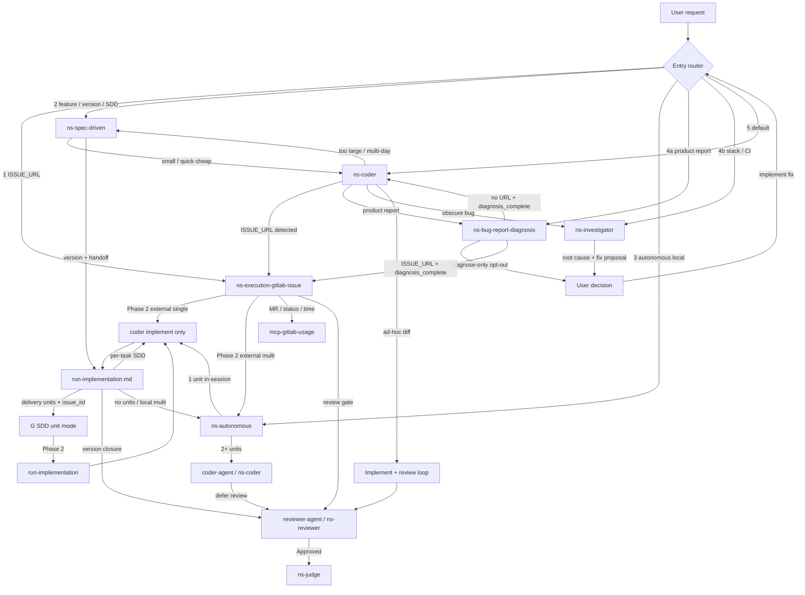

# Coder skill routing

**Version:** 1.8 (generated)
**Generated:** 2026-09-18

**Do not edit this file manually.** Source of truth lives in skills. Regenerate with:

```bash
node packages/harness/scripts/generate-coder-skill-routing-doc.mjs
```

## Canonical sources

| Source | Role |
| ------ | ---- |
| `skills/ns-harness/references/code-skill-routing.md` | Entry priority, tie-breakers, handoff summary, diagram source |
| `skills/*/references/entry-triggers.md` | Per-skill trigger phrases (priorities 1–5) |
| `skills/*/SKILL.md` routing sections | Per-skill handoffs out |
| `skills/_meta/code-skill-routing-changelog.md` | Doc version history |

---

Runtime routing: **entry priority** + cross-skill handoffs. Entry skills own triggers in `references/entry-triggers.md`. Each `SKILL.md` owns **handoffs out**.

**Derived:** `docs/coder-skill-routing.md` — do not hand-edit. Maintainer: `.cursor/skills/code-routing-diagram/`. Optional regen:

```bash
node packages/harness/scripts/generate-coder-skill-routing-doc.mjs
```

## Roles

| Role | Skill | Notes |
| ---- | ----- | ----- |
| Front door | Host + descriptions + this file | Fixed priority — not dedicated skill |
| Central execution | `ns-coder` / `C2` via spawn gate (`coder-agent` when heavy) | G, A, S converge — `subagent-dispatch.md` |
| GitLab lifecycle | `ns-execution-gitlab-issue` | External Phase 2 single-unit → `coder-agent`; multi-unit → `A`; SDD unit → `run-implementation.md` |
| Multi-unit engine | `ns-autonomous` | Standalone or Engine under G when multi-unit |
| Spec / version planning | `ns-spec-driven` | Quick cheap in-session; heavy → `coder-agent` when available |
| Product report | `ns-bug-report-diagnosis` | Screen story; chat only; no patch **here**; then `G` (URL) or `C` unless diagnose-only |
| Root-cause | `ns-investigator` | Stack/CI/log; diagnosis + Suggested Code; implement = separate user step |
| Review gate | `ns-reviewer` via `reviewer-agent` (**MUST** when available) | Code path — `../ns-reviewer/references/review-gate-workflow.md` |
| Delivery gate | `ns-judge` in-session after `Code Review: Approved` | Same parent; no `judge-agent` v1 — `../ns-judge/SKILL.md` |

## Install vs runtime

`ns-coder` `depends` installs peers at install time. Does **not** make coder the runtime router.

## Entry priority (host agent) {#entry-priority}

Scan **1 → 5**; **first matching signal wins**. Lower beats higher — e.g. `ISSUE_URL` + multi-day feature → **1** (`G`), not 2 (`S`).

| Priority | Signal | Entry skill | Trigger phrases |
| -------- | ------ | ----------- | ----------------- |
| 1 | External GitLab `ISSUE_URL` or explicit "implement this issue" | `ns-execution-gitlab-issue` | `../ns-execution-gitlab-issue/references/entry-triggers.md` |
| 1b | *(not entry scan)* SDD `unit` + `issue_iid` from `delivery-units.md` | `ns-execution-gitlab-issue` SDD unit mode | Dispatched by `ns-spec-driven` / `run-implementation.md` — **not** external URL |
| 2 | Feature / version / SDD / multi-day scope | `ns-spec-driven` | `../ns-spec-driven/references/entry-triggers.md` |
| 3 | "Run autonomously" with local plan, no issue | `ns-autonomous` | `../ns-autonomous/references/entry-triggers.md` |
| 4a | Product bug report — screen story (then auto-continue unless diagnose-only) | `ns-bug-report-diagnosis` | `../ns-bug-report-diagnosis/references/entry-triggers.md` |
| 4b | Root-cause only — stack/CI/log, **without** implement request | `ns-investigator` | `../ns-investigator/references/entry-triggers.md` |
| 5 | Default — quick fix, "implement X", small ad-hoc diff | `ns-coder` | `../ns-coder/references/entry-triggers.md` |

Scan is still **1 → 5**. 4a is checked before 4b. Either 4 row still beats 5.

### Multi-signal examples (first match wins) {#multi-signal-examples}

| User message (signals present) | Winner | Why |
| ------------------------------ | ------ | --- |
| `ISSUE_URL` + "big feature for v2" | Priority **1** → `G` | `ISSUE_URL` scanned before SDD scope |
| `ISSUE_URL` + pasted stack trace | Priority **1** → `G` | Issue execution owns worktree path |
| "Build notifications v2" + "CI is red" (no `ISSUE_URL`) | Priority **2** → `S` | SDD scope before investigator |
| "Run this plan autonomously" + stack trace in plan context | Priority **3** → `A` | Autonomous entry before diagnosis-only |
| "When I publish, the UI hangs" (no "fix") | Priority **4a** → `BRD` | Product report, no implement |
| Paste stack trace, no screen story, no implement words | Priority **4b** → `I` | Stack/CI diagnosis-only |
| "Fix this NullPointerException" | Priority **5** → `C` | Implement intent → coder, not diagnosis |

### Tie-breakers {#tie-breakers}

Only when priority table alone insufficient:

- Bug + large / multi-day (no `ISSUE_URL`) → **2** (`ns-spec-driven`).
- Product report (screen, expected vs actual), no implement → **4a** (`ns-bug-report-diagnosis`).
- Stack/CI/log, no screen story, no implement → **4b** (`ns-investigator`).
- Bug + quick fix, **cause obvious** → **5** (`ns-coder`).

### Priority 4 vs 5 {#priority-4-vs-5}

See entry-triggers for `ns-bug-report-diagnosis`, `ns-investigator`, and `ns-coder`. **Heuristic:** code change → **5**; screen story → **4a**; stack/CI → **4b**. One clarify when ambiguous; default **5**.

### Fallback

No match → **5** (`ns-coder`). Still unclear after one question: coder escalates per stop conditions.

Mid-run escalations (`C → G`, `C → S`, `C → BRD`, `C → I`) = same signals.

## Handoff edges {#handoff-edges}

Detail in each `SKILL.md` routing section.

| From | Condition | To |
| ---- | --------- | -- |
| `C` | `ISSUE_URL` detected | `G` |
| `C` | too large / multi-day SDD | `S` |
| `C` | product report, no implement, **no** `diagnosis_complete` | `BRD` |
| `C` | `diagnosis_complete: true` (BRD payload) | Implement — **do not** return to `BRD` |
| `G` | BRD handoff with URL + `diagnosis_complete` | Execution — **do not** return to 4a |
| `C` | obscure bug (stack/CI) | `I` |
| `C` | ad-hoc diff | `REV` then `JUDGE` if `Code Review: Approved` (`reviewer-agent` → `ns-reviewer`; parent reads `ns-judge`) |
| `G` | Phase 2 external, single unit | `coder-agent` / `ns-coder` in worktree (**skip** `A`) |
| `G` | Phase 2 external, multi-unit | `A` (engine mode) |
| `G` | Phase 2 SDD unit | `run-implementation.md` (unit tasks; **not** `A`) |
| `G` | MR / status / time | `mcp-gitlab-usage` |
| `G` | review gate | `REV` then `JUDGE` if Approved (`reviewer-agent` / `ns-reviewer` only for code) |
| `A` | 1 work unit | In-session `ns-coder` (worktree); defer `REV` to parent |
| `A` | ≥2 work units | `C2` (`coder-agent` → `ns-coder` — **MUST** when available); implement only |
| `C2` | implement done | Parent `REV` at closure — **no** per-unit review |
| `S` | small / quick | In-session `C` (cheap — **MUST NOT** spawn `coder-agent`) |
| `S` | version + handoff | `H` → `C` or `A` or `G` unit mode (**MUST** `coder-agent` for heavy coding workers when available) |
| `H` | delivery units + `issue_iid` | `G` SDD unit mode (`unit` + `issue_iid` — not external URL) |
| `H` | per-task coding (no unit issues) | `C` implement only — no per-task `REV` / `JUDGE` (SDD handoff) |
| `H` | all tasks done | `REV` version closure (`run-implementation` Step 5) then `JUDGE` if Approved |
| `REV` | `Code Review: Approved` | `JUDGE` (`ns-judge` in-session) |
| `I` | diagnosis complete | User (no auto-dispatch to `C`) |
| `BRD` | diagnose-only opt-out | User (stop) |
| `BRD` | `ISSUE_URL` after diagnosis | `G` |
| `BRD` | no URL after diagnosis | `C` |
| User | implement after investigator (or diagnose-only) | Re-enter entry router (usually `C`) |

## Engine anti-cycle (G ↔ A) {#engine-anti-cycle}

**External:** `G` invokes `A` Engine **only** when multi-unit (`planning-decision.md`). Single-unit external: `coder-agent` in existing worktree — no A. When A runs: units as `C2` (or in-session for 1 unit) in existing worktree + branch. `A` + `C2` must not re-open `G` — no standalone routing, no GitLab MCP mutations, no new worktree. `ISSUE_URL` in code/comments = context, not signal. `G` owns lifecycle until delivery. Rejection loops stay inside (`G → A → C2 → REV` or `G → Cimpl → REV`).

**SDD unit:** `G` invokes `run-implementation.md` / `Cimpl`. No `A`. Rejection (`G → Cimpl → REV`) stays inside. Status/spent: `delivery-units.md` **GitLab status/spent (SSoT)**.

See `../ns-autonomous/references/routing.md`.

## Investigator handoff {#investigator-handoff}

`I` ends: root cause + fix proposal. **No** auto-dispatch. User asks implement → re-enter router (usually **5** → `C`). No direct `I → C` — human gate.

## Bug-report diagnosis handoff {#bug-report-diagnosis-handoff}

`BRD` ends: eight-section chat report (tester + fixer pointer). Readonly **in BRD**. Then auto-dispatch: `ISSUE_URL` → `G`; else → `C`, with `diagnosis_complete: true`. Diagnose-only phrases ("do not fix", "só diagnostica") → stop at the user. `U2` is **opt-out only**. Low confidence still dispatches. `C`/`G` receiving that payload must not bounce to 4a. Full rule: `../ns-bug-report-diagnosis/references/continue-handoff.md`.

## Entry trigger phrases (from skills)

### Priority 1 — `ns-execution-gitlab-issue`

Source: `skills/ns-execution-gitlab-issue/references/entry-triggers.md`

Skill: `ns-execution-gitlab-issue`. Host scans this row before priorities 2–5.

## Use when

- User provides a GitLab `ISSUE_URL`
- "Implement this issue" / "execute issue #123" with GitLab context
- Issue reference (`#123`) when MCP GitLab is available and execution is intended
- BRD dispatch with `ISSUE_URL` + `diagnosis_complete: true`

## Do not use as entry

- Local ad-hoc coding without an issue → `ns-coder` (priority 5)
- Autonomous local plan without issue → `ns-autonomous` (priority 3)
- Product report / screen story without execution intent **and** without BRD `diagnosis_complete` → `ns-bug-report-diagnosis` (priority 4a)
- BRD dispatch with `ISSUE_URL` + `diagnosis_complete: true` → **this skill** (execution). Do not return to 4a.
- Stack/CI diagnosis-only without execution intent → `ns-investigator` (priority 4b)

## Example phrases

- "https://gitlab…/issues/482"
- "Implement GitLab issue 482"
- "Run issue #482 end to end"

### Priority 2 — `ns-spec-driven`

Source: `skills/ns-spec-driven/references/entry-triggers.md`

Skill: `ns-spec-driven`. Host scans after priority 1, before 3–5.

## Use when

- Feature / version / SDD / multi-day scope
- "Specify and implement version X"
- "Let's build notifications for v2"
- Resume paused SDD work (`execution-handoff.md`, partial version)
- "Write requirements for vX" with delivery intent

## Do not use as entry

- Bare quick fix without SDD context: `ns-coder` (priority 5)
- GitLab `ISSUE_URL`: `ns-execution-gitlab-issue` (priority 1)
- "Run this plan autonomously" only: `ns-autonomous` (priority 3)

## Example phrases

- "Specify user notifications for version 2.1"
- "Implement from tasks in docs/versions/1.0.0/sdd/"
- "Resume version 1.0 — handoff exists"

### Priority 3 — `ns-autonomous`

Source: `skills/ns-autonomous/references/entry-triggers.md`

Skill: `ns-autonomous` (standalone pipeline). Host scans after priorities 1–2, before 4–5.

## Use when

- "Run autonomously" / "execute this plan autonomously"
- Local plan file path (`.plan.md`, pasted execution plan) **without** GitLab issue
- Ad-hoc multi-step autonomous implementation, no `ISSUE_URL`

## Do not use as entry

- GitLab issue origin → `ns-execution-gitlab-issue` (priority 1); this skill runs only as Phase 2 engine under that flow
- Single quick edit → `ns-coder` (priority 5)
- Partitioned version with `version-roadmap.md` → `ns-spec-driven` → `references/orchestrator.md`

## Example phrases

- "Run this plan autonomously in a worktree"
- "Execute the attached execution-handoff locally, no GitLab"
- "Autonomous run — plan pasted below"

### Priority 4a — `ns-bug-report-diagnosis`

Source: `skills/ns-bug-report-diagnosis/references/entry-triggers.md`

Skill: `ns-bug-report-diagnosis`. Host scans after priorities 1–3, **before** 4b and 5. Scan **1 → 5** stays intact; 4 still beats 5.

After the eight-section report, this skill **dispatches** `ns-execution-gitlab-issue` (if `ISSUE_URL`) or `ns-coder`, unless diagnose-only. See `continue-handoff.md`.

## Use when (product report)

- Relato / ticket / described screenshot / "what is happening" / "diagnose this"
- Expected vs actual **on a screen** (button hangs, list vs detail disagree, save then reopen shows something else)
- `/ns-bug-report-diagnosis`
- Paste of a product story (who, screen, expected, actual) — even without naming this skill

Screen story still wins **4a** even when the user will want a fix afterwards. Diagnose first, then dispatch. Do not skip this skill to go straight to coder on a screen story without implement-only wording.

## Diagnose-only opt-out (report, then stop)

- "só diagnostica" / "diagnose only" / "não corrige" / "do not fix" / "don't change code" / "não mexa no código"
- `/ns-bug-report-diagnosis` with an explicit request not to implement

## Do not use as entry

- "Fix …" / "implement …" / "quick fix" **without** a screen story → `ns-coder` (priority 5)
- GitLab `ISSUE_URL` **execution as the host's first skill** ("implement this issue", bare URL) → `ns-execution-gitlab-issue` (priority 1)
- Stack trace / CI log / test output **with no screen story** → `ns-investigator` (priority 4b)
- Multi-day / version scope → `ns-spec-driven` (priority 2)
- DB-only inspection when the consumer has a DB skill

An `ISSUE_URL` **inside** this skill (user already on 4a) is read-only via MCP, then continue-handoff sends **G** with `diagnosis_complete`. Host scan still gives bare execution `ISSUE_URL` to priority 1.

## vs priority 4b (`ns-investigator`)

| This skill (4a) | Investigator (4b) |
| --------------- | ----------------- |
| Screen / product story | Stack, CI, log, failing test |
| Two audiences: tester + fixer pointer | RCA + Suggested Code |
| No patch **here**; then G or C | Minimal fix proposal; human gate remains |

## vs priority 5 (`ns-coder`)

| This skill (4a) | Coder (5) |
| --------------- | --------- |
| Screen story first, then dispatch C/G | Code change requested without a screen story, or C after `diagnosis_complete` |
| "The publish button spins forever" | "Fix the publish button" (no product story) |
| Ticket pasted as a report | Ticket + "implement this" as host entry, or BRD payload |

`diagnosis_complete: true` on a coder handoff = implement intent. Coder must **not** bounce back to 4a.

## Examples (first match still follows 1 → 5)

| User message | Winner |
| ------------ | ------ |
| "When I publish, the UI hangs with no error" | **4a** this skill, then dispatch **C** |
| Same + "do not fix" | **4a** this skill, then **stop** |
| Screen story + `ISSUE_URL` (already in 4a) | **4a** then dispatch **G** |
| Paste of a stack trace, no screen story | **4b** `ns-investigator` |
| "Fix this" / "implement the patch" (no screen story) | **5** `ns-coder` |

Recover symptom from URL / issue body / screenshot / session when the paste looks empty. Ask one clarifying question and stop only if still empty **and** no URL. Do not default to coder from an empty 4a report.

### Priority 4b — `ns-investigator`

Source: `skills/ns-investigator/references/entry-triggers.md`

Skill: `ns-investigator`. Host scans after priorities 1–3 and 4a, before 5.

## Use when (diagnosis only — no implement request)

- "Why does X break?"
- "What's causing this error?"
- "Investigate this failure"
- "Root cause of …"
- Paste-only: stack trace, CI log, test output, exception — **no** fix/implement words, **no** screen story
- "CI failed on main" / "pipeline broke" without "fix it"

## Do not use as entry

- Product report / screen expected vs actual / "what is happening on this screen" → `ns-bug-report-diagnosis` (priority 4a)
- "Fix …" / "implement …" / "quick fix" → `ns-coder` (priority 5)
- GitLab `ISSUE_URL` → `ns-execution-gitlab-issue` (priority 1)
- Multi-day / version scope → `ns-spec-driven` (priority 2)

## vs priority 4a (`ns-bug-report-diagnosis`)

| This skill (4b) | Bug-report diagnosis (4a) |
| --------------- | ------------------------- |
| Stack, CI, log, failing test | Screen / product story |
| RCA + Suggested Code | Tester language + fixer pointer, no patch |

## vs priority 5 (`ns-coder`)

| This skill (4b) | Coder (5) |
| --------------- | --------- |
| Understanding only | Code change requested |
| "Why does login fail?" (error/log) | "Fix login failure" |
| Stack trace paste only | Stack trace + "fix this" |
| "CI is red" | "CI is red — fix it" |

One clarifying question if ambiguous. If still unclear after that, host defaults to priority **5**.

### Priority 5 — `ns-coder`

Source: `skills/ns-coder/references/entry-triggers.md`

Skill: `ns-coder`. Host scans after priorities 1–4; also **fallback** when no row matches.

## Use when

- "Fix …" / "fix this bug" / "quick fix" / "hotfix"
- "Implement …" / "just implement" / "add field to …"
- "Change X to Y" (small ad-hoc diff)
- "Make it work" / "resolve this error" (action, not analysis only)
- Stack trace **+** "fix this" / "what's wrong and fix it"
- Concrete coding task without `execution-handoff.md`
- BRD handoff with `diagnosis_complete: true`

## Do not use as entry

- GitLab `ISSUE_URL` → `ns-execution-gitlab-issue` (priority 1)
- Feature / version / SDD / multi-day → `ns-spec-driven` (priority 2)
- Autonomous multi-step local plan → `ns-autonomous` (priority 3)
- Product report / screen expected vs actual, no implement words, **no** `diagnosis_complete` → `ns-bug-report-diagnosis` (priority 4a)
- BRD / parent handoff with `diagnosis_complete: true` → **this skill** (implement). Do not redirect to 4a.
- Diagnosis only (stack/CI/log), no implement words → `ns-investigator` (priority 4b)
- Version with `execution-handoff.md` → `references/run-implementation.md` via `ns-spec-driven`

## vs priority 4a / 4b

See `../../ns-bug-report-diagnosis/references/entry-triggers.md` and `../../ns-investigator/references/entry-triggers.md`. **Heuristic:** code change requested → this skill; screen story **without** `diagnosis_complete` → 4a; stack/CI → 4b. Payload `diagnosis_complete: true` = implement intent.

## Fallback

No qualifier matches → this skill. If scope stays unclear after one question, escalate per SKILL.md stop conditions.

## Skill handoffs (diagram)

Extracted from `skills/ns-harness/references/code-skill-routing.md`:



Engine mode: `A` and `C2` do not re-enter `G` — see `skills/ns-autonomous/references/routing.md`.

---

## Changelog

Tracks `docs/coder-skill-routing.md` (generated) and canonical skill sources.

| Version | Date | Trace | Changes |
| ------- | ---- | ----- | ------- |
| 1.0 | — | — | Initial routing diagram and install note |
| 1.1 | 2026-07-28 | doc iteration | Entry priority prose (**doc-only** — superseded) |
| 1.2 | 2026-07-28 | skills routing session | Canonical `ns-harness/references/code-skill-routing.md`; skills aligned |
| 1.3 | 2026-07-28 | skills routing session | Multi-signal rule and tie-breakers in harness reference |
| 1.5 | 2026-09-12 | code then judge | `REV → JUDGE` after `Code Review: Approved`; `ns-judge` delivery gate |
| 1.6 | 2026-09-12 | spawn gate | Cheap vs heavy execute; G single-unit skips A; C2 defer per-unit REV |
| 1.7 | 2026-09-18 | product-report diagnosis | Priority **4a** `ns-bug-report-diagnosis` (screen story); **4b** `ns-investigator` (stack/CI); scan 1→5 intact |
| 1.8 | 2026-09-18 | BRD auto-handoff | After the eight-section report, `BRD → G` (`ISSUE_URL`) or `BRD → C` (else), payload `diagnosis_complete`. Diagnose-only opt-out keeps `BRD → U2`. `C`/`G` must not bounce to 4a with that payload. |
