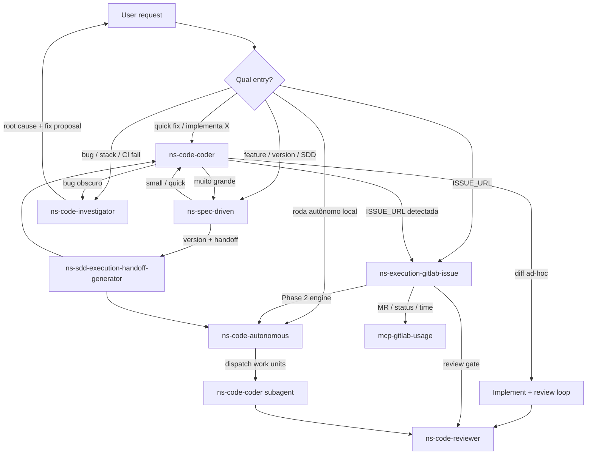

# Coder skill routing (current)

How NextStage implementation skills relate today. `ns-code-coder` is a **worker**, not the entry router — peer skills own GitLab, autonomous, and SDD flows.

## Who guides what

| Concern | Owner skill |
| -------- | ----------- |
| Ad-hoc diff + review loop | `ns-code-coder` |
| GitLab issue lifecycle | `ns-execution-gitlab-issue` |
| Multi-unit / worktree engine | `ns-code-autonomous` |
| Spec / version planning | `ns-spec-driven` |
| Root-cause debugging | `ns-code-investigator` |

## Install note

`ns-code-coder` `depends` pulls the full `ns-code-*` suite (install-time). That does **not** make coder the runtime router.
