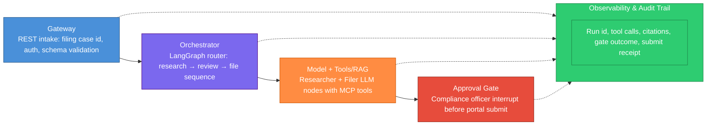
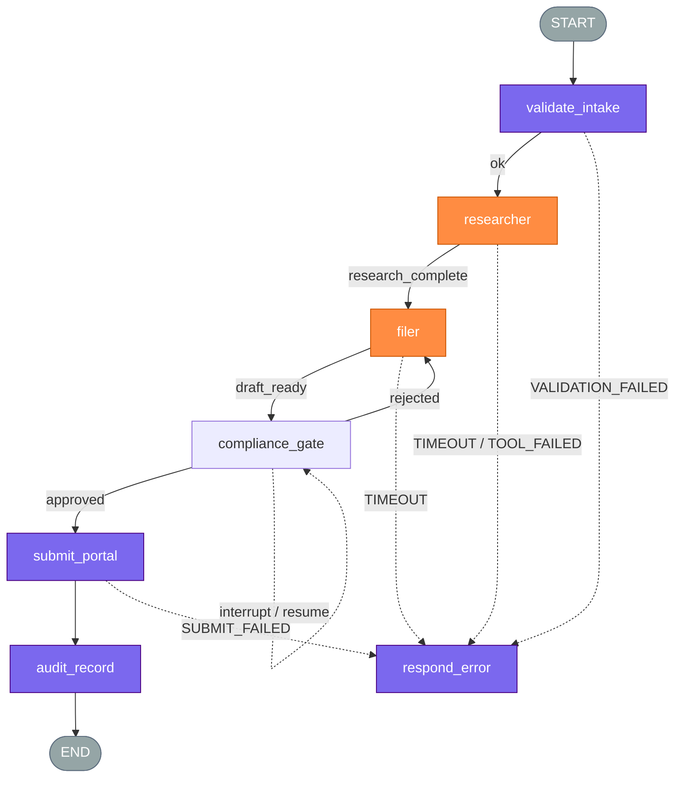

# Multi-Agent Architecture

> Generated by ns-agent-architecture skill
> **Handoff:** This document is the single source of truth for implementation. No prior conversation context is required.
> **Decision record:** the **Why this design** section is the durable rationale — README and `graph-spec.md` link here; they do not rewrite it.
> **Living:** one file for the product agent. Update in place. Append Changelog. Do not copy into `docs/versions/`.

## Changelog

| Version | Date | Summary |
| ------- | ---- | ------- |
| adhoc-2026-09-07 | 2026-09-07 | Initial ADR — multi-agent compliance filing (researcher + filer + HITL); Failure contract, Compensation, Inter-agent events locked per `references/inter-agent-transport.md` |

## Problem Statement

Build a multi-agent compliance filing system with two specialist agents — a **researcher** that gathers regulatory evidence from internal corpus and external registries, and a **filer** that assembles and submits filings to the regulator portal. Every submission is irreversible and must pass **human-in-the-loop (HITL)** approval before the filer executes the portal write. The deliverable is an implementation handoff ADR only; no stakeholder defense pack.

## Reference Architecture

Canonical AI-first diagram for this case. Structure is fixed; first line of each box is the doctrine id; second line describes this product.



| Component | Role in this case | Exists today? |
| --------- | ----------------- | ------------- |
| Gateway | REST `/filings` — JWT auth, rate limit, JSON schema for case id + filing type | no |
| Orchestrator | LangGraph deterministic nodes: validate case, route research→assemble→gate→submit | no |
| Model + Tools/RAG | Researcher (RAG + registry MCP) and Filer (draft + portal MCP) LLM nodes | no |
| Approval Gate | `interrupt()` before `submit_filing`; compliance officer UI with editable draft fields | no |
| Observability | Postgres audit: run_id, node, tool, citations, approver_id, submit receipt | partial |

## Subtask Decomposition

The three questions were applied **per subtask**, not to the product.

| Subtask | Type | P1 | P2 | P3 | Component | Source | Status |
| --- | --- | --- | --- | --- | --- | --- | --- |
| Validate filing case intake | extraction/interpretation | yes | no | no | rule | interview | confirmed |
| Research regulatory requirements | extraction/interpretation | no | no | yes | agent | interview | confirmed |
| Assemble filing package | business decision | no | no | yes | agent | interview | confirmed |
| Compliance officer review | business decision | no | yes | no | agent + gate (sync) | interview | confirmed |
| Submit to regulator portal | business decision | no | yes | no | rule + conditional gate | interview | confirmed |
| Record audit trail | extraction/interpretation | yes | no | no | rule | interview | confirmed |

- P1 — finite rule covers >90% of real cases
- P2 — error costly **and** irreversible → gate before the action
- P3 — behavior changes with input context

**Reclassification trigger:** If research queries stabilize to <5 template patterns covering >90% of filing types for 60 days, promote researcher row to `rule + conditional gate` with cached playbooks.

## Trade-off Budget

| Component | Latency | Cost | Precision | Throughput | Non-negotiable axis |
| --------- | ------- | ---- | --------- | ---------- | ------------------- |
| Gateway | low (<200ms) | low | high | high | latency |
| Orchestrator | low | low | high | medium | precision |
| Model + Tools/RAG | medium (30–90s) | medium | high | low | precision |
| Approval Gate | high (hours SLA) | low | high | low | precision |
| Observability | low | low | high | high | precision |

## Orchestration pattern

| Segment | Pattern | Why (dependency signal) | Rejected alternative |
| ------- | ------- | ----------------------- | -------------------- |
| Intake → research | Sequential | Filer needs research citations before assembly | Parallel — filer would hallucinate requirements |
| Research → assembly | Sequential | Filer consumes researcher output in state | Supervisor — no routing ambiguity; fixed pipeline |
| Assembly → submit | Sequential + sync gate | Irreversible portal write requires ordered gate | Async gate — compliance wants same-session review for MVP |

## Failure contract

Per-agent timeout, retry, exhaustion policy, and idempotency for duplicate delivery (`references/inter-agent-transport.md`: at-least-once listeners must be idempotent).

| Agent | Timeout | Max retries | On exhaustion | Idempotent on duplicate |
| ----- | ------- | ----------- | ------------- | ----------------------- |
| Researcher | 120s | 2 | availability (proceed with partial citations + flag) | yes — dedupe by `(run_id, query_hash)` in state |
| Filer | 90s | 1 | consistency (block) — no draft without complete research | yes — draft keyed by `run_id`; ignore duplicate `research_complete` |
| Portal submit (orchestrator node) | 60s | 3 | consistency (block) — never double-submit | yes — regulator idempotency key `filing_id + content_hash` |

## Compensation

Multi-write chain: research artifacts → filing draft → portal submission. Undo paths and trigger owner locked.

| Step | Produces | Compensating action | Who triggers |
| ---- | -------- | ------------------- | ------------ |
| Researcher completes | Citation bundle + requirement checklist in state | Clear research fields; re-run from research node | orchestrator |
| Filer assembles draft | Filing package JSON + attachment refs | Discard draft; restore pre-assembly state snapshot | orchestrator |
| HITL rejects | Approved=false audit event | Return to filer with officer notes; no portal call | HITL (compliance officer via interrupt resume) |
| Portal submit succeeds | Regulator receipt id | Request withdrawal API if regulator supports; else manual ticket + audit flag | HITL — only compliance officer may initiate withdrawal |

## Inter-agent events

Event contract includes transport and delivery guarantee per `references/inter-agent-transport.md`. Scope: per filing flow (`run_id`). Subscribe-before-emit enforced in orchestrator startup.

| Event | Emitted by | Payload | Listeners | Pattern | Transport | Delivery guarantee |
| ----- | ---------- | ------- | --------- | ------- | --------- | ------------------ |
| `filing:research_complete` | Researcher | `{ run_id, citations[], requirement_ids[], confidence }` | Filer | Sequential | in-process emitter (shared LangGraph process) | at-least-once |
| `filing:draft_ready` | Filer | `{ run_id, draft_id, package_uri, missing_fields[] }` | Orchestrator (gate router) | Sequential | in-process emitter | at-least-once |
| `filing:approval_decided` | Approval Gate | `{ run_id, approved, approver_id, approver_role, edits{} }` | Filer, Orchestrator | Handoff | in-process emitter | at-most-once |
| `filing:submit_complete` | Orchestrator | `{ run_id, regulator_receipt_id, submitted_at }` | Observability | Saga | broker (Postgres NOTIFY → audit worker) | at-least-once |

**Transport doctrine applied:** Researcher→Filer and Filer→Gate events use **in-process emitter** (single LangGraph worker; listener always up; no cross-crash replay needed for MVP). Submit receipt uses **broker** (Postgres NOTIFY) because audit worker is a separate process and must survive orchestrator crash. **At-least-once** on research/draft/submit events ⇒ listeners idempotent per Failure contract. **At-most-once** on approval_decided — duplicate approve/resume rejected by gate state machine.

## Architecture Change Signal

**Element:** Observability

**Signal (one sentence):** If >15% of filing runs require manual re-research after filer assembly (logged as `rework_reason=missing_citation`) for two consecutive sprints, split researcher into domain-specialist agents or add a supervisor routing layer.

## Why this design

| Question | Locked answer |
| -------- | ------------- |
| Agent vs code | 2 agent rows (research, assemble); 4 rule/gate rows (intake, review gate, submit, audit) |
| One vs many | Two specialists — researcher vocab/tools (RAG, registries) diverge from filer (portal schema, attachments); shared risk profile on submit |
| Concurrency / orchestration | Sequential pipeline research→filer→gate→submit; rejected parallel extract — filer depends on citations |
| Who uses the output | Compliance officer consumes draft for approval; wrong submit = regulatory penalty + recall cost |
| Topology / framework | LangGraph — formal HITL interrupts, deterministic routing, audit replay; rejected CrewAI — weaker interrupt/resume for sync compliance gate |
| HITL | Sync interrupt on `draft_ready`; compliance officer edits fields; approver role = Compliance Officer; always-escalate = all filing types |
| Success in production | ≥95% first-pass approval rate (no rework loop) within officer SLA |
| Out of MVP | Multi-filing batch, async multi-day review queue, auto-withdrawal |

## Interview Record

| # | Question | Recommended answer | User answer | Locked decision |
|---|----------|-------------------|-------------|-----------------|
| 0 | Initial context | — | Multi-agent compliance filing: researcher + filer + HITL. After ADR decline defense pack. | Scope = two agents + sync HITL before irreversible submit |
| 1 | Overall objective? | Automate regulatory filing prep with specialist research and gated portal submit | Agreed | Objective locked |
| 2 | End-to-end journey? | In: case id + filing type → Out: regulator receipt after officer approval | Yes | I/O locked |
| 3 | Gateway role? | REST intake with JWT + schema validation | Agreed | Gateway = REST `/filings` |
| 4 | Gateway classifies intent? | No — single filing pipeline; filing type is explicit input field | Agreed | No intent classification |
| 5 | Orchestrator role? | LangGraph sequential router research→assemble→gate→submit | Agreed | Orchestrator locked |
| 6 | Model + Tools/RAG? | Researcher (RAG + registries); Filer (draft + portal MCP) | Agreed | Two LLM nodes locked |
| 7 | Approval Gate? | Sync interrupt before submit; compliance officer | Agreed | Sync HITL locked |
| 8 | Observability? | Postgres audit: run, tools, citations, gate, receipt | Agreed | Audit store locked |
| 9 | Subtask grid confirm? | 6 rows as shown | Confirmed | Grid locked |
| 10 | Classify validate intake? | P1=yes → rule | Agreed | rule |
| 11 | Classify research? | P3=yes → agent | Agreed | agent |
| 12 | Classify assemble? | P3=yes → agent | Agreed | agent |
| 13 | Classify officer review? | P2=yes → agent + gate sync | Agreed | agent + gate |
| 14 | Classify portal submit? | P2=yes → rule + conditional gate | Agreed | rule + gate |
| 15 | Classify audit? | P1=yes → rule | Agreed | rule |
| 16 | Trade-off Gateway? | Non-negotiable: latency | Agreed | latency |
| 17 | Trade-off Orchestrator? | Non-negotiable: precision | Agreed | precision |
| 18 | Trade-off Model? | Non-negotiable: precision | Agreed | precision |
| 19 | Trade-off Gate? | Non-negotiable: precision | Agreed | precision |
| 20 | Trade-off Observability? | Non-negotiable: precision | Agreed | precision |
| 21 | Architecture change signal? | Observability: >15% rework after assembly for 2 sprints | Agreed | Signal locked |
| 22 | Researcher I/O shape? | Reads case + filing type; writes citations + requirements | Agreed | I/O locked |
| 23 | Filer I/O shape? | Reads citations; writes draft package | Agreed | I/O locked |
| 24 | Integration errors? | Block submit on tool failure; surface structured error | Agreed | Fail-fast on tool errors |
| 25 | Control vs autonomy pillar? | Rigid sequential paths — LangGraph signal | Agreed | Control > autonomy |
| 26 | State complexity pillar? | Feedback loop on reject → filer rework | Agreed | Complex state — LangGraph |
| 27 | HITL pillar? | Formal sync interrupt — LangGraph signal | Agreed | Formal HITL |
| 28 | Scope pillar? | Enterprise compliance resilience | Agreed | LangGraph over CrewAI |
| 29 | Specialist boundary? | Research vocab/tools diverge from filer portal schema | Agreed | Two agents justified |
| 30 | Autonomy per segment? | Fixed pipeline — not emergent collaboration | Agreed | Fixed orchestration |
| 31 | Orchestration pattern? | Sequential research→filer; handoff at gate | Agreed | Patterns locked |
| 32 | Researcher failure policy? | 120s, 2 retries, proceed with gap on exhaustion | Agreed | Researcher failure row |
| 33 | Filer failure policy? | 90s, 1 retry, block on exhaustion | Agreed | Filer failure row |
| 34 | Submit failure policy? | 60s, 3 retries, block; idempotent key | Agreed | Submit failure row |
| 35 | Compensation chain? | Undo draft on reject; withdrawal by officer | Agreed | Compensation table |
| 36 | Who triggers compensation? | Orchestrator for state; HITL for withdrawal | Agreed | Triggers locked |
| 37 | Inter-agent event names? | research_complete, draft_ready, approval_decided, submit_complete | Agreed | Events locked |
| 38 | Transport? | In-process for agent events; broker for audit | Agreed | Transport per inter-agent-transport.md |
| 39 | Delivery guarantee? | at-least-once agent events; at-most-once approval | Agreed | Guarantees locked |
| 40 | Provider? | Azure OpenAI — enterprise compliance | Agreed | Provider locked |
| 41 | Hosting? | API — corpus in VPC via private endpoint | Agreed | VPC-bound API |
| 42 | Success metric? | ≥95% first-pass approval | Agreed | Metric locked |
| 43 | Defense pack? | No — implement-only handoff | No | No defense file; ADR is SoT |

### Assumptions

| Assumption | Status |
| ---------- | ------ |
| Regulator portal exposes MCP or REST submit with idempotency key | assumed — validate with stakeholder |
| Compliance officer available for sync review in MVP | confirmed |
| Internal regulatory corpus indexed in Postgres/pgvector | assumed — validate with stakeholder |

## Functional Requirements

| ID | Requirement | Source (interview #) |
|----|-------------|---------------------|
| FR-01 | Accept filing case via authenticated REST with schema validation | Q3 |
| FR-02 | Researcher retrieves citations from corpus + external registries | Q6, Q22 |
| FR-03 | Filer assembles draft package from researcher output only | Q23 |
| FR-04 | System interrupts before portal submit; officer may edit draft fields | Q7 |
| FR-05 | Submit executes only on `approved=true` with idempotency key | Q14, Q34 |
| FR-06 | Emit `filing:research_complete` at-least-once in-process; filer idempotent | Q38, Q39 |
| FR-07 | On HITL reject, orchestrator clears draft and routes to filer with notes | Q35 |
| FR-08 | Audit records run_id, tools, citations, approver, receipt | Q8 |
| FR-09 | Researcher timeout 120s / 2 retries; partial proceed with flag | Q32 |
| FR-10 | Filer timeout 90s / 1 retry; block on exhaustion | Q33 |

## MVP Scope

| In scope (MVP) | Out of scope (post-approval / v2) |
|----------------|-----------------------------------|
| Single filing type (annual compliance report) | Multi-type routing at Gateway |
| Researcher + Filer + sync HITL | Async multi-day review queue |
| LangGraph graph with interrupt | CrewAI alternative |
| In-process events + Postgres audit broker | External Kafka |
| Azure OpenAI via private endpoint | On-prem model hosting |

## Framework Recommendation

- **Chosen framework:** LangGraph
- **Alternative considered:** CrewAI — rejected because sync HITL interrupt/resume and deterministic audit replay are first-class in LangGraph; CrewAI process hooks are weaker for compliance gate
- **Technical rationale:** Four pillars (control, complex state, formal HITL, enterprise resilience) all signal LangGraph; sequential multi-agent with `interrupt()` matches filing pipeline

## Proposed Architecture

- **Topology type:** Sequential DAG with sync interrupt gate
- **State management:** TypedDict shared state; researcher writes `citations`, filer writes `draft`, gate writes `approval`
- **Human interaction point:** Compliance officer UI at `draft_ready` interrupt

### State schema

```typescript
interface FilingState {
  run_id: string;
  case_id: string;
  filing_type: string;
  citations: Array<{ source: string; excerpt: string; requirement_id: string }>;
  requirement_ids: string[];
  draft: { draft_id: string; package_uri: string; fields: Record<string, unknown> } | null;
  approval: { approved: boolean; approver_id: string; approver_role: string; edits: Record<string, unknown> } | null;
  regulator_receipt_id: string | null;
  errors: Array<{ node: string; code: string; message: string }>;
  events_seen: Set<string>; // idempotency for at-least-once
}
```

### Constraints

| Constraint | Decision |
| ---------- | -------- |
| Eval / acceptance | Citation coverage ≥90% vs gold checklist; draft schema valid |
| HITL | Sync interrupt; Compliance Officer; all filing types always-escalate |
| End user | Compliance officer; wrong submit = regulatory penalty |
| Success metric | ≥95% first-pass approval within SLA |
| Audit | Full reconstruct from Postgres; HITL resume = new audit event |
| Cost / latency | 90s filer cap; block submit on exceed |
| Degrade | Research partial → flag + officer alert; no silent submit |

### Error contract

```json
{
  "run_id": "",
  "status": "interrupted | validation_failed | tool_failed",
  "failed_at": "node_name",
  "message": "",
  "details": {}
}
```

### LangGraph flow diagram



| Color | Block | Node ids (this graph) |
| ----- | ----- | --------------------- |
| Purple | Orchestrator | validate_intake, submit_portal, audit_record, respond_error |
| Orange | Model + Tools/RAG | researcher, filer |
| Gray | — | START, END |
| Dashed edge | Approval Gate | compliance_gate interrupt / resume |

## Agent Design (Persona Blueprint)

### Researcher `[MVP]`

- **Subtask row:** Research regulatory requirements
- **Role / responsibility:** Gather citations and requirement checklist for filing type
- **Why this agent (not code / not a sibling):** P3 — query strategy varies by filing type and corpus gaps

| Component | Sizing | Why |
| --------- | ------ | --- |
| Memory | short only | Citations written to state |
| Planning | chain-of-thought | Multi-source synthesis |
| Tools | 3 | corpus RAG, registry lookup, requirement mapper |
| Action | reversible | Read-only retrieval |

- **Inputs:** `case_id`, `filing_type`
- **Outputs:** `citations[]`, `requirement_ids[]`
- **Agent tools:** `search_corpus`, `lookup_registry`, `map_requirements`
- **Recommended model:** GPT-4o — precision on regulatory text
- **Acceptance criteria:** ≥90% requirement coverage vs gold checklist

### Filer `[MVP]`

- **Subtask row:** Assemble filing package
- **Role / responsibility:** Build regulator-schema draft from research output
- **Why this agent (not code / not a sibling):** P3 — field mapping varies by filing context

| Component | Sizing | Why |
| --------- | ------ | --- |
| Memory | short only | Draft in state |
| Planning | direct | Template-driven assembly |
| Tools | 2 | schema validator, attachment builder |
| Action | behind gate | Submit is gated |

- **Inputs:** `citations[]`, `requirement_ids[]`
- **Outputs:** `draft` package
- **Agent tools:** `validate_schema`, `build_attachments`
- **Recommended model:** GPT-4o — structured output fidelity
- **Acceptance criteria:** Draft passes schema validation; all requirement_ids addressed

## Recommended Tooling Stack

### Agent tools (per-agent callable)

| Tool | Used by | Purpose |
|------|---------|---------|
| search_corpus | Researcher | Internal regulatory RAG |
| lookup_registry | Researcher | External requirement IDs |
| map_requirements | Researcher | Checklist generation |
| validate_schema | Filer | Regulator JSON schema check |
| build_attachments | Filer | PDF/XML package assembly |
| submit_filing | Orchestrator (post-gate) | Portal write via MCP |

### Infrastructure and supporting tools

| Category | Recommendation | Why |
|----------|----------------|-----|
| Orchestration | LangGraph SDK | HITL interrupt, sequential multi-agent |
| Provider | Azure OpenAI | Enterprise compliance, private endpoint |
| Hosting mode | API | VPC-bound; corpus never leaves tenant |
| Data egress | to provider API via private link | Regulatory text sent for inference only |
| Failover provider | none (MVP) | Tool surface not portable |
| State / persistence | Postgres checkpointer | Resume + audit |
| Vector / RAG | pgvector | Corpus in VPC |
| Observability | LangSmith + Postgres audit | Trace + compliance reconstruct |
| Output generation | Regulator portal MCP | Irreversible submit |

## Implementation Plan

### Phase 1 — MVP foundation

- [ ] Define `FilingState` TypedDict and Postgres checkpointer
- [ ] Implement Gateway REST `/filings` with JWT + schema
- [ ] Build researcher node with corpus RAG + registry MCP tools
- [ ] Build filer node with schema validator
- [ ] Wire `compliance_gate` interrupt with officer UI
- [ ] Implement in-process event emitter for research_complete / draft_ready
- [ ] Lock Failure contract timeouts and idempotency keys
- [ ] Postgres NOTIFY broker for submit_complete audit worker

### Phase 2 — Production hardening

- [ ] Gold-set eval for citation coverage and first-pass approval rate
- [ ] Compensation paths: reject loop, withdrawal API
- [ ] Load test at-least-once idempotency under retry storms
- [ ] Alert on architecture change signal (>15% rework)

## Next Steps and Risks

- **Identified risk:** Partial research proceeding with gap may reach filer with silent missing citations — mitigate with `missing_fields[]` in `draft_ready` payload and officer checklist UI
- **Implementation tip:** Register event listeners in graph compile hook before any node runs (`subscribe before emit` per `references/inter-agent-transport.md`)
