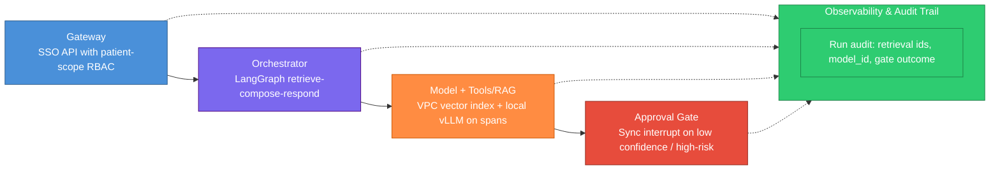
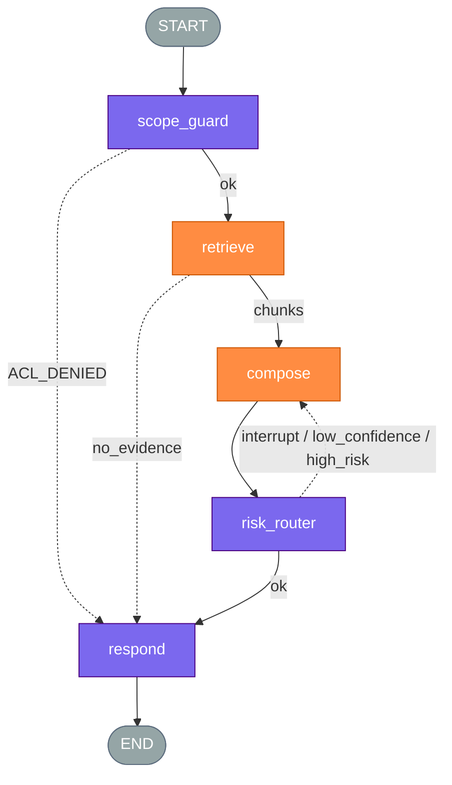

# Multi-Agent Architecture

> Generated by ns-agent-architecture skill  
> **Handoff:** This document is the single source of truth for implementation. No prior conversation context is required.  
> **Decision record:** the **Why this design** section is the durable rationale — README and `graph-spec.md` link here; they do not rewrite it.  
> **Living:** one file for the product agent. Update in place. Append Changelog. Do not copy into `docs/versions/`.

## Changelog

| Version | Date | Summary |
| ------- | ---- | ------- |
| adhoc-2026-09-07 | 2026-09-07 | Initial ADR: in-VPC patient-note assistant; Model block locked to zero egress, VPC-local Llama/vLLM, cost optimized inside boundary |

## Problem Statement

Clinical staff need accurate, cited answers and summaries over a corpus of patient notes. The corpus **cannot leave the VPC** (PHI / compliance boundary). The team must pick **provider and hosting for the Model block** and also cares about **cost**. Per `references/provider-selection.md`, data egress is a compliance lock and must be decided **before** cost; public paid APIs that send note text to a vendor are disqualified.

## Reference Architecture



| Component | Role in this case | Exists today? |
| --------- | ----------------- | ------------- |
| Gateway | Internal HTTPS API; OIDC SSO; RBAC patient scope; rate limit | no |
| Orchestrator | Compiled LangGraph: scope guard → retrieve → model → respond; conditional interrupt | no |
| Model + Tools/RAG | In-VPC OpenSearch/pgvector over note embeddings; vLLM Llama on retrieved spans only | partial |
| Approval Gate | Sync HITL when confidence < 0.75 or high-risk clinical category | no |
| Observability | Append-only audit: user, role, mrn hash, retrieval ids, model_id, gate outcome | partial |

## Subtask Decomposition

| Subtask | Type | P1 | P2 | P3 | Component | Source | Status |
| --- | --- | --- | --- | --- | --- | --- | --- |
| Authenticate and scope patient access | business decision | yes | n/a | no | rule | interview | confirmed |
| Retrieve relevant note spans from VPC index | extraction/interpretation | no | no | yes | agent | interview | confirmed |
| Compose grounded answer or summary | extraction/interpretation | no | yes | yes | agent + gate (sync) | interview | confirmed |
| Route low-confidence / high-risk to physician | business decision | yes | yes | no | rule + conditional gate | interview | confirmed |

**Reclassification trigger:** If retrieval queries stabilize to fixed templates with >90% recall without LLM rewrite, fold retrieve row into orchestrator rule; if new note types break AWQ quality, escalate agent row complexity.

## Trade-off Budget

| Component | Latency | Cost | Precision | Throughput | Non-negotiable axis |
| --------- | ------- | ---- | --------- | ---------- | ------------------- |
| Gateway | low | low | high | medium | precision |
| Orchestrator | low | low | high | medium | precision |
| Model + Tools/RAG | medium | medium (optimized post-egress lock) | high | medium | precision |
| Approval Gate | medium | low | high | low | precision |
| Observability | low | low | high | high | precision |

**Provider doctrine note:** Cost for Model + Tools/RAG is negotiated only **after** data-egress and hosting locks (`provider-selection.md` hard rule #2). External cheap APIs are not eligible trade-offs.

## Orchestration pattern

| Segment | Pattern | Why | Rejected alternative |
| ------- | ------- | ----- | -------------------- |
| Scope → retrieve → compose | sequential | Each step depends on prior artifact (scoped index → spans → answer) | parallel retrieve+compose — risks unscoped generation |
| High-risk branch | handoff (control to physician) | Originator run pauses; physician owns decision | consult-and-return — insufficient for sync clinical accountability |

## Architecture Change Signal

**Element:** Model + Tools/RAG

**Signal (one sentence):** p95 interactive latency exceeds 8 seconds for 14 consecutive days while average GPU utilization stays below 40%, forcing revisiting model tier, quantization, or replica count inside the VPC.

## Why this design

| Question | Locked answer |
| -------- | ------------- |
| Agent vs code | Scope and HITL routing = rules; retrieval and compose = agents with sync gate on compose |
| One vs many | Single retrieve + single compose agent — shared clinical vocabulary and tools; no specialist split |
| Concurrency / orchestration | Sequential graph with conditional interrupt — rejected emergent multi-agent crew |
| Who uses the output | Nurses and physicians at bedside; wrong summary delays care or causes harm |
| Topology / framework | LangGraph for deterministic gates and interrupt/resume — rejected CrewAI (informal HITL) |
| HITL | Sync interrupt on confidence < 0.75 or high-risk category; attending physician approves |
| Success in production | ≥90% clinician rubric pass on held-out ward queries with zero egress violations in audit |
| Out of MVP | Multi-ward rollout, fine-tuned clinical adapter, async approval queues |

## Interview Record

| # | Question | Recommended answer | User answer | Locked decision |
|---|----------|-------------------|-------------|-----------------|
| 0 | Initial context | — | Corpus cannot leave VPC; pick Model provider/hosting; care about cost | Compliance boundary stated upfront |
| 1 | Overall objective | In-VPC clinical Q&A/summarization with citations | (preferred) Agreed | Objective locked |
| 2 | End-to-end I/O | Scoped query → cited answer + audit | (preferred) Yes | I/O locked |
| 3 | Gateway | SSO + RBAC scope at edge | (preferred) Lock | Gateway locked |
| 4 | Orchestrator | LangGraph deterministic graph | (preferred) Yes | Orchestrator locked |
| 5 | Model + Tools/RAG | VPC RAG + local inference | (preferred) Lock | Model block role locked |
| 6 | Approval Gate | Sync on low confidence / high-risk | (preferred) Lock | Gate locked |
| 7 | Observability | Immutable audit trail | (preferred) Lock | Observability locked |
| 8 | Subtask grid | 4 rows as proposed | (preferred) Confirm | Grid locked |
| 9–12 | Per-row P1/P2/P3 | See transcript | (preferred) All accepted | Classification locked |
| 13–16 | Trade-off budget | Precision non-negotiable per component | (preferred) Accepted | Budget locked |
| 17 | Change signal | Model latency/GPU mismatch | (preferred) Lock | Signal locked |
| 18 | **Data egress (Model)** | **Zero leave VPC before any cost talk** — `provider-selection.md` #2 | (preferred) No egress | **Data egress locked first** |
| 19 | Hosting mode | VPC-local inference, not public API | (preferred) VPC-local | Hosting locked |
| 20 | Provider | Llama 3.x via vLLM in VPC | (preferred) Accept | Provider locked |
| 21 | Cost (after egress) | AWQ + GPU sizing inside VPC only | (preferred) Accept | Cost optimized post-compliance |
| 22 | Failover provider | Secondary in-VPC quant vLLM; tools survive | (preferred) Accept | Failover locked |
| 23–24 | Four pillars | Rigid graph + formal HITL | (preferred) Accept | Pillars locked |
| 25 | Defense pack | No — ADR only | (preferred) No | No defense file |

### Assumptions

| Assumption | Status |
| ---------- | ------ |
| Note embeddings can be computed and stored entirely inside the existing clinical VPC | assumed — validate with infra |
| Llama 3 70B AWQ meets clinical summary quality on ward pilot set | assumed — validate with eval set |
| SSO/RBAC already exists for EHR applications | assumed — validate with security |

## Functional Requirements

| ID | Requirement | Source |
|----|-------------|--------|
| FR-01 | System SHALL reject requests where user role cannot access requested MRN | Q3 |
| FR-02 | System SHALL retrieve note spans only from in-VPC indexes | Q5, Q18 |
| FR-03 | System SHALL NOT transmit note text, embeddings, or retrieval payloads outside the VPC | Q18 |
| FR-04 | System SHALL invoke LLM only via VPC-local vLLM endpoints | Q19–Q20 |
| FR-05 | System SHALL interrupt synchronously when confidence < 0.75 or high-risk category | Q6 |
| FR-06 | System SHALL log retrieval ids, model_id, prompt_version, gate outcome per run | Q7 |
| FR-07 | System SHALL failover to secondary in-VPC quant model without changing tool schemas | Q22 |
| FR-08 | Cost optimizations (quantization, replica count) SHALL NOT bypass egress lock | Q21 |

## MVP Scope

| In scope (MVP) | Out of scope (post-approval / v2) |
|----------------|-----------------------------------|
| Single ward pilot | Enterprise multi-tenant isolation |
| Llama 3 70B AWQ on one GPU replica | Horizontal multi-region |
| Sync gate on high-risk list + confidence | Async approval queues |
| Audit trail with note_id citations | Custom fine-tune on PHI |

## Framework Recommendation

- **Chosen framework:** LangGraph
- **Alternative considered:** CrewAI — rejected; informal checkpoints insufficient for sync clinical HITL and audit-grade routing
- **Technical rationale:** Formal `interrupt()`, deterministic conditional edges, and stateful resume match P2 clinical gates and compliance audit requirements

## Proposed Architecture

- **Topology type:** Sequential DAG with conditional interrupt edges
- **State management:** TypedDict holds query, scoped mrn, retrieval chunks, draft answer, confidence, gate status
- **Human interaction point:** Sync interrupt node before returning high-risk or low-confidence answers

### State schema

```python
from typing import TypedDict, Literal, Optional

class ClinicalAgentState(TypedDict):
    run_id: str
    user_id: str
    role: str
    mrn: str
    query: str
    retrieval_ids: list[str]
    chunks: list[dict]
    draft_answer: str
    citations: list[dict]
    confidence: float
    risk_category: Optional[str]
    gate_status: Literal["none", "pending", "approved", "rejected"]
    model_id: str
    degraded_failover: bool
```

### Constraints

| Constraint | Decision |
| ---------- | -------- |
| Eval / acceptance | ≥90% clinician rubric on held-out queries; zero egress violations |
| HITL | Sync interrupt; physician approves high-risk / low-confidence |
| End user | Clinical staff; error impacts patient care workflow |
| Success metric | Rubric pass rate + audit-confirmed zero external note transmission |
| Audit | Yes — append-only store; HITL resume is new audit event |
| Cost / latency | Cost optimized after egress lock; p95 target 5s interactive |
| Degrade | Failover to in-VPC 8B quant; never external API |

### Error contract

```json
{
  "run_id": "",
  "status": "interrupted | validation_failed | insufficient_evidence",
  "failed_at": "node_name",
  "message": "",
  "details": {}
}
```

### LangGraph flow diagram



| Color | Block | Node ids |
| ----- | ----- | -------- |
| Purple | Orchestrator | scope_guard, risk_router, respond |
| Orange | Model + Tools/RAG | retrieve, compose |
| Gray | — | START, END |
| Dashed edge | Approval Gate | interrupt on risk_router → compose |

## Agent Design (Persona Blueprint)

### retrieve `[MVP]`

- **Subtask row:** Retrieve relevant note spans from VPC index
- **Role / responsibility:** Rewrite query if needed; call vector search; return ranked spans
- **Why this agent (not code / not a sibling):** P3 — recall strategy shifts with query phrasing

| Component | Sizing | Why |
| --------- | ------ | --- |
| Memory | short only | Query + prior retrieval attempt in state |
| Planning | direct | Single search pass for MVP |
| Tools | 2 | search_notes, get_note_span |
| Action | reversible | Retrieval is read-only |

- **Inputs:** query, mrn, scope filters
- **Outputs:** chunks, retrieval_ids
- **Agent tools:** search_notes, get_note_span
- **Recommended model:** Llama-3-8B-AWQ via vLLM (cheaper retrieval tier inside VPC)
- **Acceptance criteria:** Recall@5 ≥ target on gold query set; no outbound network to non-VPC endpoints

### compose `[MVP]`

- **Subtask row:** Compose grounded answer or summary
- **Role / responsibility:** Generate cited answer strictly from retrieved chunks
- **Why this agent (not code / not a sibling):** P2 + P3 — clinical wording and synthesis vary by context; errors need sync gate

| Component | Sizing | Why |
| --------- | ------ | --- |
| Memory | short only | Retrieved chunks in context window |
| Planning | chain-of-thought | Internal reasoning improves faithfulness |
| Tools | 0 | Generation only on provided spans |
| Action | behind gate | Sync HITL on low confidence / high-risk |

- **Inputs:** chunks, query, citations template
- **Outputs:** draft_answer, citations, confidence
- **Agent tools:** none (MVP)
- **Recommended model:** Llama-3-70B-AWQ via vLLM (primary VPC-local production tier)
- **Acceptance criteria:** Citation span match on gold set; gate fires on seeded high-risk prompts

## Recommended Tooling Stack

Per `references/provider-selection.md`: **data egress is a compliance lock decided before cost**; prototype vs production hosting must be recorded; failover is an explicit design row; provider swap requires re-locking tool surface and history ownership (orchestrator owns conversation state).

### Agent tools (per-agent callable)

| Tool | Used by | Purpose |
|------|---------|---------|
| search_notes | retrieve | Vector + keyword hybrid over in-VPC note index |
| get_note_span | retrieve | Fetch exact note text slice by id + offsets |

### Infrastructure and supporting tools

| Category | Recommendation | Why |
|----------|----------------|-----|
| Orchestration | LangGraph SDK | Deterministic graph, sync interrupt, audit-friendly state |
| **Provider** | **Meta Llama 3.x (70B AWQ primary; 8B AWQ retrieval/failover) via vLLM** | Open weights deployable entirely inside VPC; no third-party inference SaaS |
| **Hosting mode** | **VPC-local (production)** | Corpus cannot leave boundary — disqualified public paid API (`provider-selection.md` axis: local = corpus never leaves machine/VPC) |
| **Data egress** | **Never leaves VPC** | Compliance lock (#2): decided **before** cost; note text/embeddings never sent to external vendor APIs |
| **Failover provider** | **Secondary vLLM endpoint — Llama-3-8B-AWQ in same VPC** | yes — tool schemas unchanged; orchestrator retains history; degraded tier logged in audit (`provider-selection.md` #4) |
| State / persistence | Postgres (VPC) | Run state, gate resume, audit |
| Vector / RAG | OpenSearch or pgvector in VPC | Embeddings computed and queried without egress |
| Document parsing | Existing EHR ingest pipeline | Notes already in VPC object store |
| Observability | OpenTelemetry + append-only audit table | Reconstruct route, model_id, gate outcome |
| Output generation | Structured JSON response API | Citations + confidence for UI |

## Implementation Plan

### Phase 1 — MVP foundation

- [ ] Deploy vLLM Llama-3-70B-AWQ and 8B-AWQ in clinical VPC
- [ ] Index ward notes into in-VPC vector store; verify zero egress with network policy tests
- [ ] Implement LangGraph: scope_guard → retrieve → compose → risk_router → respond
- [ ] Wire sync interrupt UI for high-risk categories
- [ ] Append-only audit with retrieval ids and model_id

### Phase 2 — Production hardening

- [ ] Failover routing primary 70B → secondary 8B on timeout
- [ ] Load test p95 latency; tune GPU replica vs quant per change signal
- [ ] Clinician rubric eval gate ≥90% before ward expansion

## Next Steps and Risks

- **Identified risk:** Local 70B AWQ quality ceiling vs prior cloud API experience — mitigate with held-out clinical eval before rollout
- **Implementation tip:** Prove egress compliance with VPC flow logs denying outbound 443 to non-approved destinations before enabling compose node
