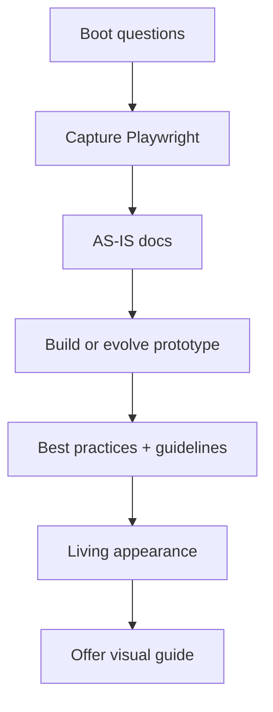

# Proto Creator

**Delivery face:** Playwright reverse prototyping. Capture → AS-IS docs → create/evolve one `prototype/` → quality → living appearance → optional visual guides.

**Orchestrate.** Load worker `SKILL.md` at delegation. No inline full design checklists or Element|How tables.

## Layout (locked)

```
prototype/              # THE prototype — create once, evolve forever
docs/                   # AS-IS briefs, screenshots, appearance guides
docs/specs/             # Living domain specs (when consolidating)
```

- Missing `prototype/` → **create**.
- Existing `prototype/` → **evolve in place**.
- Never scaffold `vN/prototype/` or ask version-folder name. Versioning = **git**. Optional: remind commit after meaningful evolve.

## Harness

See `../../ns-harness/references/session-boot.md` and `../../ns-harness/references/artifact-layout.md`.

## Near-miss routing

| User wants | Redirect |
| ---------- | -------- |
| Only `*-visual.md` / descrição normativa / guia de aparência | `ns-proto-visual-guide` |
| Full SDD version / requirements / tasks | `ns-spec-driven` |
| Bare bugfix, no prototype scope | `ns-coder` |
| Brownfield architecture map only | Tell user run `/ns-harness prepare` |

## Boot (mandatory, once per session)

Short natural-language questions. No giant questionnaire.

1. **Base URL** — login / which Playwright MCP profile if multiple.
2. **Scope** — screens, roles, add/change.
3. **Prototype mode** — detect `prototype/`:
   - absent → **create**
   - present → **evolve in place**

No version-id / `v1` folder question.

## Journey



| Phase | Reference / worker | Behavior |
| ----- | ------------------ | -------- |
| Capture | `references/capture-playwright.md` | Discover Playwright MCP; navigate; screenshots; note structure, fonts, icons, density |
| AS-IS | `references/as-is-docs.md` | Write/update `docs/` briefs from evidence |
| Build / Evolve | `references/build-prototype.md` + `ns-frontend-design` | Only under `prototype/`; mirror flows/fields/states; modern stack — no legacy clone |
| Quality | `ns-best-practices` | Hygiene + Web Interface Guidelines review on prototype surfaces |
| Living | `ns-living-spec` **appearance** | Create `docs/specs/` + INDEX if missing; SHALL for visible product behavior only |
| Handoff | `ns-proto-visual-guide` | Offer / run for implementation appearance MDs |

## Hard rules

- One prototype tree; evolve in place; never parallel `vN/` copies
- Fidelity from live Playwright evidence; no invented screens
- Stack-free modern UI under `prototype/` — load `ns-frontend-design`
- English for this skill's artifacts; project docs language follows repo
- Versioning = git; optional commit remind after meaningful evolve
- No hardcoded product-specific login — project rules / user credentials path

## Related skills

- `ns-proto-visual-guide` — normative appearance MDs
- `/ns-harness` `codebase-reverse-spec.md` — business reverse from code (complement URL capture)
- `ns-frontend-design` / `ns-best-practices` — design + quality workers
