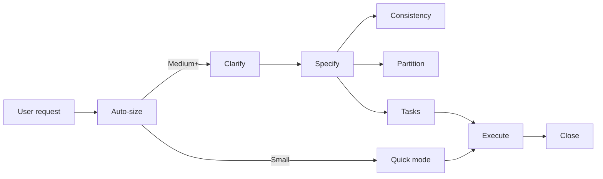

# NextStage Spec-Driven

**Delivery face** for the spec-driven journey: clarify → specify → (consistency / partition) → tasks → execute → close.

You **orchestrate** — you do **not** replace worker skills. Read each worker `SKILL.md` at delegation time. State lives on **disk** (`docs/versions/`, `docs/context/`, handoff files), not chat history.

## Harness discovery

See `../nextstage-harness/references/harness-discovery.md` and `../nextstage-harness/references/artifact-layout.md`.

| Variable | Resolve via |
| -------- | ----------- |
| `{product_root}` | `AGENTS.md` product anchor |
| `{harness_root}` | Harness discovery |
| `{version_san}` | User scope or existing folder under `docs/versions/` |

## Out of band (not this skill)

**Brownfield onboarding** is manual — never auto-run, never a pipeline phase:

| Need | Skill |
| ---- | ----- |
| Full prepare after `harness init` | `/harness-prepare` or `npx @nextstage-brasil/harness prepare` |
| Single worker only | Invoke that worker directly |

If `architecture-rules.md` is still a stub or `docs/context/brownfield-map.md` is missing and the task needs them: **tell the user to run `/harness-prepare`**, then stop — or continue SDD **only if they insist** after the warning.

## Journey (delivery only)



| Phase | When | Worker |
| ----- | ---- | ------ |
| Clarify | Ambiguity / gray areas | `pm-clarify-requirements` |
| Specify | Always for Medium+ | `pm-requirements-generator` |
| Consistency | Before tasks (Large+) | `pm-analyze-consistency` |
| Partition | Multi-slice versions | `pm-version-partitioner` |
| Tasks | Medium+ formal tasks | `pm-task-generator` + `execution-handoff-generator` |
| Execute | Always | See execute routing below |
| Close | After delivery | `code-reviewer` → `pm-living-spec-consolidator` |
| Quick | ≤3 files, one-sentence scope | `code-coder` only |

Details: `references/auto-sizing.md`, `references/router.md`.

## Boot (mandatory, once per session)

1. Resolve `{product_root}` and `{harness_root}`.
2. Classify request → **Small / Medium / Large** (see `references/auto-sizing.md`).
3. Check for **resume** signals (`execution-handoff.md`, partial version) → `references/session-continuity.md`.
4. Scan installed complements (soft) → `references/skill-integrations.md`.
5. Confirm **once** when needed: `{product_root}`, target version id, and language for markdown artifacts.

## Orchestration mandate

- **Delegate** — follow the worker skill workflow; do not reimplement it inline.
- **Do not** ask "continue to next phase?" between phases in the same sized pipeline.
- **Do not** invoke `harness-prepare` or any brownfield prepare worker.
- **Do not** load multiple version specs into context — see `references/context-budget.md`.
- After each phase, verify expected artifact paths exist before advancing.

## Auto-size summary

| Size | Pipeline |
| ---- | -------- |
| **Small** | `code-coder` (quick mode — `references/quick-mode.md`) |
| **Medium** | Clarify (if needed) → Specify → Tasks + handoff → Execute → Close |
| **Large** | Full chain including Consistency and/or Partition when scope warrants |

**Safety valve:** if inline steps exceed ~3 files or scope explodes mid-session → stop and formalize via Medium+ pipeline (requirements + tasks).

## Execute routing

| Context | Worker |
| ------- | ------ |
| Ad-hoc / quick / single task | `code-coder` |
| Version with `execution-handoff.md` | `execution-handoff-generator` run-implementation + `code-coder` or `code-autonomous` |
| Partitioned version (subversions) | `execution-orchestrator` |
| GitLab issue URL + MCP available | `execution-gitlab-issue` (soft — prefer when GitLab present) |
| Autonomous multi-step local plan | `code-autonomous` |

## Trigger → reference

| User says | Read first |
| --------- | ---------- |
| "specify", "requirements for vX" | `references/router.md` → Specify |
| "clarify", vague scope | `references/router.md` → Clarify |
| "implement", "build version", tasks exist | `references/session-continuity.md` + Execute |
| "quick fix", "just change X" | `references/quick-mode.md` |
| "resume", "continue version" | `references/session-continuity.md` |
| UI / design work | `references/skill-integrations.md` → `code-frontend-design` |
| README / docs | `references/skill-integrations.md` → `code-docs-writer` |
| security headers / modernize | `references/skill-integrations.md` → `code-best-practices` |
| MR / PR review | `code-reviewer` directly (not this face) |

## Soft integrations

Before relevant work, check `.agents/skills/` for complements. If present → **delegate**. If absent → continue with workers/rules and **recommend install once per session**:

```bash
npx @nextstage-brasil/harness --preset complements --yes
```

See `references/skill-integrations.md`.

## Completion summary

When a version or quick fix closes, report:

1. Artifacts written or updated (paths).
2. Handoff status if applicable.
3. Suggested next step (living spec done → next version clarify; quick fix → optional review).

## Forbidden

- Auto-run or chain `harness-prepare`.
- List Prepare as an SDD phase.
- Hard-require complement skills.
- Generate requirements/tasks yourself without delegating to PM workers.
- Skip `execution-handoff-generator` when formal tasks exist for a version.

## Invocation examples

```
/nextstage-spec-driven
```

```
Specify and implement user notifications for version 2.1
```

```
Quick fix: add nullable email field to the signup form
```

```
Resume implementation — handoff exists for docs/versions/1.0.0/
```
