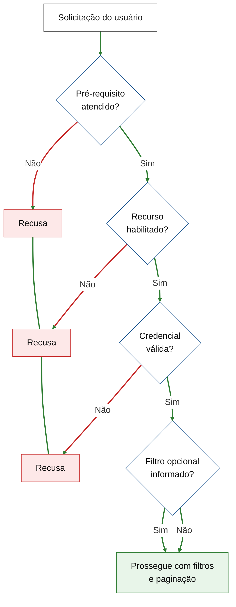
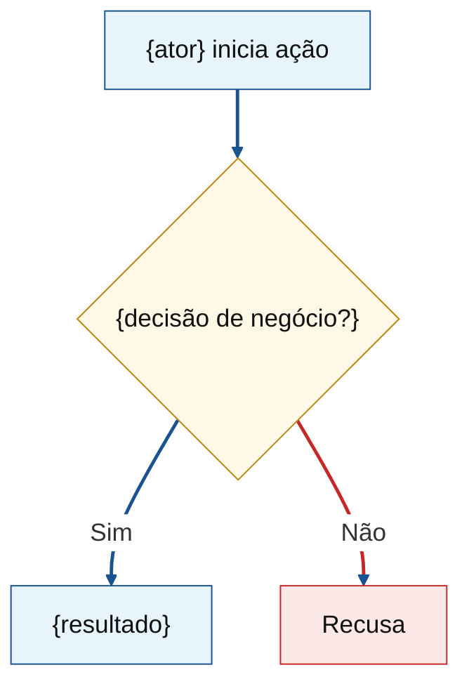

# Dual-audience voice (commercial budget)

Client first. Delivery team second. Client signs scope. Team keeps sizing detail.

## Audience test

| Section | Client | Team |
|---------|--------|------|
| Objetivo, Features, fluxos, RNFs, riscos | Product/commercial plain | Every committed capability covered |
| Critérios de aceite | Stakeholder verifiable | Each maps scoped behavior, no gap |
| Estimativas | Totals + per-Feature FP readable | FP origem traceable; COSMIC table full; horas = formula |
| Macroatividades | Lifecycle split | Unchanged |

**Both pass:** client would sign? engineering finds no missing boundary?

## Client-facing

Capabilities, journeys, roles, outcomes, constraints. Brief menu/screen labels OK. Delivery risk in product terms (homologação, contrato parceiro, escopo aberto).

## Detail placement

| Need | Here | Not here |
|------|------|----------|
| Scope | Features + aceite + Mermaid | Classes, schemas, endpoints |
| FP trace | Estimativas origem + per-Feature FP | Feature narrative |
| COSMIC | CFP table | E/R/W/X prose |
| Hours math | Estimativas cálculo | Narrative in horas row |

## Forbidden (narrative)

Class/service/module/file. DB/ORM/migrations. API fields, HTTP codes, OpenAPI story. Framework/infra unless human set commercial constraint (one line). Code, `/api/...` paths. Internal paths (`docs/context/...`) — say "contexto de produto consultado".

## Rewrite

| Leak | Fix |
|------|-----|
| `tipo_pessoa = ORCRIM` | Só cadastros organização criminosa |
| Persist `api_key` hash | Admin atualiza chave integração |
| EO/EQ IFPUG ILF | FP origem in Estimativas; Feature = capability |
| GET paginated | Consulta paginada cadastros elegíveis |

## Acceptance criteria

Who does what, what shows, what must not. "O administrador consegue…" / "O parceiro recebe…". Not "controller retorna 401".

## Fluxos Mermaid

1–3 max. PT-BR labels (English doc only if human asks). Roles + business actions. Client validates; team spots gaps. No technical node names.

Subtitle: `### Fluxo N — {title}`.

### Layout

- Default `flowchart TD`. `LR` only short linear (≤3 nodes).
- Short labels (~5 words). Long text: `<br/>` in `["…"]`.
- Always quoted nodes `["…"]` / `{"…"}`.
- One journey or decision chain per diagram. Split at ~12 nodes.
- Cross-ref ok: `Validações de acesso<br/>(fluxo 3)`.

### Styling (mandatory)

Default theme unreadable in preview/PDF. Every diagram: init block + `classDef` + `linkStyle`.

**Init (journey — copy):**

```
%%{init: {'themeVariables': {'fontSize': '18px', 'fontFamily': 'arial', 'background': '#ffffff', 'mainBkg': '#ffffff', 'secondBkg': '#ffffff', 'clusterBkg': '#ffffff', 'lineColor': '#1a5490', 'primaryBorderColor': '#1a5490', 'edgeLabelBackground': '#ffffff', 'primaryTextColor': '#111'}}}%%
```

Validation/rejection diagrams: `'lineColor': '#2e7d32'`.

**Palette A — journey:**

```
classDef passo fill:#e8f4fc,stroke:#1a5490,color:#111
classDef decisao fill:#fff8e6,stroke:#b8860b,color:#111
```

`passo` = actions/outcomes/start/end. `decisao` = diamonds.

**Palette B — validation chain:**

```
classDef inicio fill:#ffffff,stroke:#333,color:#111
classDef decisao fill:#ffffff,stroke:#1a5490,color:#111
classDef recusa fill:#fde8e8,stroke:#c62828,color:#111
classDef sucesso fill:#e8f5e9,stroke:#2e7d32,color:#111
```

Rejections stack right: `R1 ~~~ R2`.

### linkStyle (mandatory after class)

Palette A: `linkStyle default stroke:#1a5490,stroke-width:2.5px`

Palette B: success `linkStyle default stroke:#2e7d32,stroke-width:2.5px`; rejections `linkStyle {indices} stroke:#c62828,stroke-width:2.5px` (0-based edge order).

Example indices: `A-->B` = 0, `B-->|Não|R1` = 1 (red), `B-->|Sim|C` = 2 (green default).

### Skeleton — validation chain

Optional filter: both Sim/Não may hit success (no rejection for omitted optional filter).



### Skeleton — journey



### Anti-patterns

`LR` + long labels. Theme only, no white bg. No `linkStyle`. Rejection same color as success on validation chain. Mandatory rejection on optional filter. Technical labels (class, table, HTTP). >3 diagrams or >12 nodes without split.

## Risks and premissas

Product/delivery language. **Responsável** per risk: Cliente / Empresa / Ambos.
