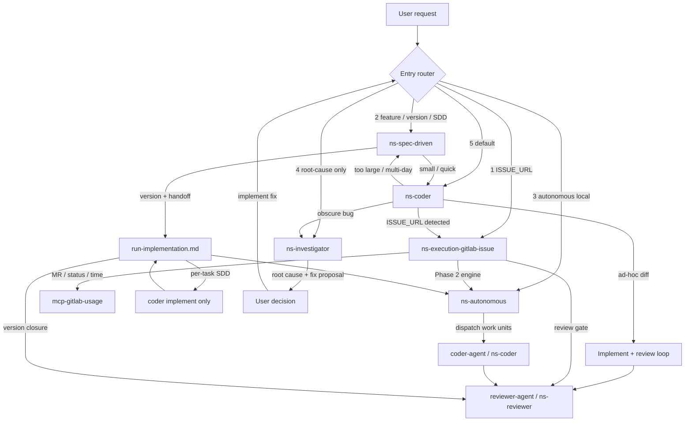

# Code skill routing

Runtime routing: **entry priority** + cross-skill handoffs. Entry skills own triggers in `references/entry-triggers.md`. Each `SKILL.md` owns **handoffs out**.

**Derived:** `docs/coder-skill-routing.md` — do not hand-edit. Maintainer: `.cursor/skills/code-routing-diagram/`. Optional regen:

```bash
node packages/harness/scripts/generate-coder-skill-routing-doc.mjs
```

## Roles

| Role | Skill | Notes |
| ---- | ----- | ----- |
| Front door | Host + descriptions + this file | Fixed priority — not dedicated skill |
| Central execution | `ns-coder` / `C2` via `coder-agent` (**MUST** when available) | G, A, S converge — `subagent-dispatch.md` |
| GitLab lifecycle | `ns-execution-gitlab-issue` | Phase 2 → A |
| Multi-unit engine | `ns-autonomous` | Standalone or engine under G |
| Spec / version planning | `ns-spec-driven` | → C or A (**MUST** `coder-agent` when available) |
| Root-cause | `ns-investigator` | Diagnosis only; implement = separate user step |
| Review gate | `ns-reviewer` via `reviewer-agent` (**MUST** when available) | Only review path — `../ns-reviewer/references/review-gate-workflow.md` |

## Install vs runtime

`ns-coder` `depends` installs peers at install time. Does **not** make coder the runtime router.

## Entry priority (host agent) {#entry-priority}

Scan **1 → 5**; **first matching signal wins**. Lower beats higher — e.g. `ISSUE_URL` + multi-day feature → **1** (`G`), not 2 (`S`).

| Priority | Signal | Entry skill | Trigger phrases |
| -------- | ------ | ----------- | ----------------- |
| 1 | GitLab `ISSUE_URL` or explicit "implement this issue" | `ns-execution-gitlab-issue` | `../ns-execution-gitlab-issue/references/entry-triggers.md` |
| 2 | Feature / version / SDD / multi-day scope | `ns-spec-driven` | `../ns-spec-driven/references/entry-triggers.md` |
| 3 | "Run autonomously" with local plan, no issue | `ns-autonomous` | `../ns-autonomous/references/entry-triggers.md` |
| 4 | Root-cause only — **without** implement request | `ns-investigator` | `../ns-investigator/references/entry-triggers.md` |
| 5 | Default — quick fix, "implement X", small ad-hoc diff | `ns-coder` | `../ns-coder/references/entry-triggers.md` |

### Multi-signal examples (first match wins) {#multi-signal-examples}

| User message (signals present) | Winner | Why |
| ------------------------------ | ------ | --- |
| `ISSUE_URL` + "big feature for v2" | Priority **1** → `G` | `ISSUE_URL` scanned before SDD scope |
| `ISSUE_URL` + pasted stack trace | Priority **1** → `G` | Issue execution owns worktree path |
| "Build notifications v2" + "CI is red" (no `ISSUE_URL`) | Priority **2** → `S` | SDD scope before investigator |
| "Run this plan autonomously" + stack trace in plan context | Priority **3** → `A` | Autonomous entry before diagnosis-only |
| Paste stack trace, no implement words | Priority **4** → `I` | Diagnosis-only |
| "Fix this NullPointerException" | Priority **5** → `C` | Implement intent → coder, not investigator |

### Tie-breakers {#tie-breakers}

Only when priority table alone insufficient:

- Bug + large / multi-day (no `ISSUE_URL`) → **2** (`ns-spec-driven`).
- Bug + quick fix, **cause unclear** → **4** (`ns-investigator`).
- Bug + quick fix, **cause obvious** → **5** (`ns-coder`).

### Priority 4 vs 5 {#priority-4-vs-5}

See entry-triggers for `ns-investigator` + `ns-coder`. **Heuristic:** code change → **5**; understanding only → **4**. One clarify when ambiguous; default **5**.

### Fallback

No match → **5** (`ns-coder`). Still unclear after one question: coder escalates per stop conditions.

Mid-run escalations (`C → G`, `C → S`, `C → I`) = same signals.

## Handoff edges {#handoff-edges}

Detail in each `SKILL.md` routing section.

| From | Condition | To |
| ---- | --------- | -- |
| `C` | `ISSUE_URL` detected | `G` |
| `C` | too large / multi-day SDD | `S` |
| `C` | obscure bug | `I` |
| `C` | ad-hoc diff | `REV` (`reviewer-agent` → `ns-reviewer` — `../ns-reviewer/references/review-gate-workflow.md` + `subagent-dispatch.md`) |
| `G` | Phase 2 | `A` (engine mode) |
| `G` | MR / status / time | `mcp-gitlab-usage` |
| `G` | review gate | `REV` (`reviewer-agent` / `ns-reviewer` only) |
| `A` | dispatch work units | `C2` (`coder-agent` → `ns-coder` — **MUST** bridge when available) |
| `C2` | review | `REV` (`reviewer-agent` / `ns-reviewer` only) |
| `S` | small / quick | `C` via `coder-agent` (**MUST** when available) |
| `S` | version + handoff | `H` → `C` or `A` (**MUST** `coder-agent` for coding workers when available) |
| `H` | per-task coding | `C` implement only — no per-task `REV` (SDD handoff) |
| `H` | all tasks done | `REV` version closure (`run-implementation` Step 5) |
| `I` | diagnosis complete | User (no auto-dispatch to `C`) |
| User | implement proposed fix | Re-enter entry router (usually `C`) |

## Engine anti-cycle (G ↔ A) {#engine-anti-cycle}

`G` invokes `A` Engine mode: units as `C2` in existing worktree + branch. `A` + `C2` must not re-open `G` — no standalone routing, no GitLab MCP mutations, no new worktree. `ISSUE_URL` in code/comments = context, not signal. `G` owns lifecycle until delivery. Rejection loops (`G → A → C2 → REV`) stay inside.

See `../ns-autonomous/references/routing.md`.

## Investigator handoff {#investigator-handoff}

`I` ends: root cause + fix proposal. **No** auto-dispatch. User asks implement → re-enter router (usually **5** → `C`). No direct `I → C` — human gate.

## Skill handoffs (diagram source)

Mermaid extracted into `docs/coder-skill-routing.md` by generator.


