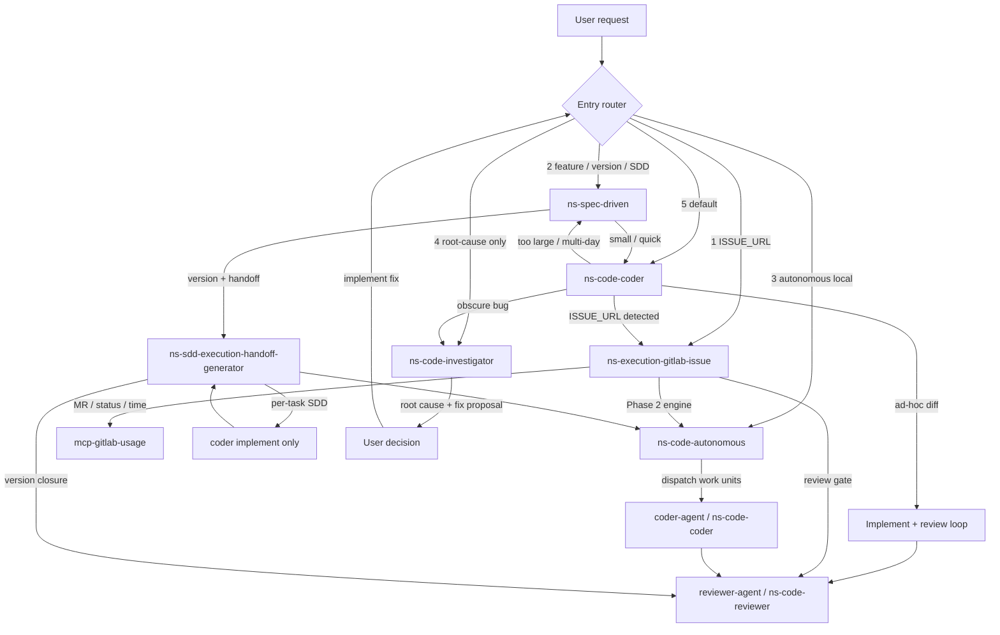

# Code skill routing

Canonical runtime routing between NextStage implementation skills. The host agent uses this file for **entry priority** and cross-skill handoffs. Each entry skill owns trigger phrases in `references/entry-triggers.md`. Each skill's `SKILL.md` documents its own **handoffs out**.

**Derived doc:** `docs/coder-skill-routing.md` may be generated locally — do not edit by hand. Maintainer diagram workflow: `.cursor/skills/code-routing-diagram/`. After changing skills, optional:

```bash
node packages/harness/scripts/generate-coder-skill-routing-doc.mjs
```

## Roles

| Role | Skill | Notes |
| ---- | ----- | ----- |
| Front door (entry router) | Host agent + skill descriptions + this file | Fixed priority below — not a dedicated skill |
| Central execution worker | `ns-code-coder` / `C2` via `coder-agent` (**MUST** when available) | G, A, and S converge here for diffs + review — `subagent-dispatch.md` |
| GitLab lifecycle | `ns-execution-gitlab-issue` | Delegates coding to A in Phase 2 |
| Multi-unit engine | `ns-code-autonomous` | Standalone entry or engine under G |
| Spec / version planning | `ns-spec-driven` | Hand off to C or A (**MUST** `coder-agent` when available) |
| Root-cause debugging | `ns-code-investigator` | Diagnosis; implementation is a separate user step |
| Review gate | `ns-code-reviewer` via `reviewer-agent` (**MUST** when available) | Only allowed review path — `review-gate-workflow.md` |

## Install vs runtime

`ns-code-coder` `depends` installs the full `ns-code-*` suite at install time. That does **not** make coder the runtime router.

## Entry priority (host agent) {#entry-priority}

**Rule:** scan priorities **1 → 5**; the **first row whose signal matches wins**. Lower number always beats higher when multiple signals appear in one message — e.g. `ISSUE_URL` + multi-day feature → priority **1** (`G`), not priority 2 (`S`).

| Priority | Signal | Entry skill | Trigger phrases |
| -------- | ------ | ----------- | ----------------- |
| 1 | GitLab `ISSUE_URL` or explicit "implement this issue" | `ns-execution-gitlab-issue` | `../../ns-execution-gitlab-issue/references/entry-triggers.md` |
| 2 | Feature / version / SDD / multi-day scope | `ns-spec-driven` | `../../ns-spec-driven/references/entry-triggers.md` |
| 3 | "Run autonomously" with a local plan, no issue | `ns-code-autonomous` | `../../ns-code-autonomous/references/entry-triggers.md` |
| 4 | Root-cause only — **without** an implement request | `ns-code-investigator` | `../../ns-code-investigator/references/entry-triggers.md` |
| 5 | Default — quick fix, "implement X", small ad-hoc diff | `ns-code-coder` | `../../ns-code-coder/references/entry-triggers.md` |

### Multi-signal examples (first match wins) {#multi-signal-examples}

| User message (signals present) | Winner | Why |
| ------------------------------ | ------ | --- |
| `ISSUE_URL` + "big feature for v2" | Priority **1** → `G` | `ISSUE_URL` scanned before SDD scope |
| `ISSUE_URL` + pasted stack trace | Priority **1** → `G` | Issue execution owns the worktree path |
| "Build notifications v2" + "CI is red" (no `ISSUE_URL`) | Priority **2** → `S` | SDD scope before investigator |
| "Run this plan autonomously" + stack trace in plan context | Priority **3** → `A` | Autonomous entry before diagnosis-only |
| Paste stack trace, no implement words | Priority **4** → `I` | Diagnosis-only |
| "Fix this NullPointerException" | Priority **5** → `C` | Implement intent → coder, not investigator |

### Tie-breakers (same priority band or ambiguous scope) {#tie-breakers}

Apply only when the priority table alone does not decide:

- Bug + large / multi-day feature (no `ISSUE_URL`) → priority **2** (`ns-spec-driven`).
- Bug + quick fix, **cause unclear** → priority **4** (`ns-code-investigator`).
- Bug + quick fix, **cause obvious** from the message → priority **5** (`ns-code-coder`).

### Priority 4 vs 5 {#priority-4-vs-5}

Owned by entry skills — see `../../ns-code-investigator/references/entry-triggers.md` and `../../ns-code-coder/references/entry-triggers.md`. **Heuristic:** code change requested → **5**; understanding only → **4**. One clarifying question when ambiguous; default **5** if still unclear.

### Fallback

No qualifier matches → priority **5** (`ns-code-coder`). If scope is still unclear after one clarifying question, coder escalates per its stop conditions.

Mid-run coder escalations (`C → G`, `C → S`, `C → I`) use the same signals as the table above.

## Handoff edges (summary) {#handoff-edges}

Per-skill detail lives in each `SKILL.md` routing section.

| From | Condition | To |
| ---- | --------- | -- |
| `C` | `ISSUE_URL` detected | `G` |
| `C` | too large / multi-day SDD | `S` |
| `C` | obscure bug | `I` |
| `C` | ad-hoc diff | `REV` (`reviewer-agent` → `ns-code-reviewer` — `review-gate-workflow.md` + `subagent-dispatch.md`) |
| `G` | Phase 2 | `A` (engine mode) |
| `G` | MR / status / time | `mcp-gitlab-usage` |
| `G` | review gate | `REV` (`reviewer-agent` / `ns-code-reviewer` only) |
| `A` | dispatch work units | `C2` (`coder-agent` → `ns-code-coder` — **MUST** bridge when available) |
| `C2` | review | `REV` (`reviewer-agent` / `ns-code-reviewer` only) |
| `S` | small / quick | `C` via `coder-agent` (**MUST** when available) |
| `S` | version + handoff | `H` → `C` or `A` (**MUST** `coder-agent` for coding workers when available) |
| `H` | per-task coding | `C` implement only — no per-task `REV` (SDD handoff) |
| `H` | all tasks done | `REV` version closure (`run-implementation` Step 5) |
| `I` | diagnosis complete | User (no auto-dispatch to `C`) |
| User | implement proposed fix | Re-enter entry router (usually `C`) |

## Engine anti-cycle (G ↔ A) {#engine-anti-cycle}

When `G` invokes `A` in Engine mode, work units run as `C2` inside the existing worktree and branch. `A` and `C2` must not re-open `G`: no standalone routing, no GitLab MCP mutations, no new worktree. An `ISSUE_URL` in code or comments is context, not a routing signal — `G` remains the single lifecycle owner until delivery completes. Review rejection loops (`G → A → C2 → REV`) stay inside that boundary.

See `../../ns-code-autonomous/references/routing.md`.

## Investigator handoff {#investigator-handoff}

`I` ends with root cause + fix proposal to the user. It does **not** auto-dispatch implementation. When the user asks to implement the fix, they re-enter through the entry router (usually priority 5 → `C`). There is no direct `I → C` skill handoff — the human gate sits between diagnosis and diff.

## Skill handoffs (diagram source)

Mermaid below is extracted into `docs/coder-skill-routing.md` by the generator script.


