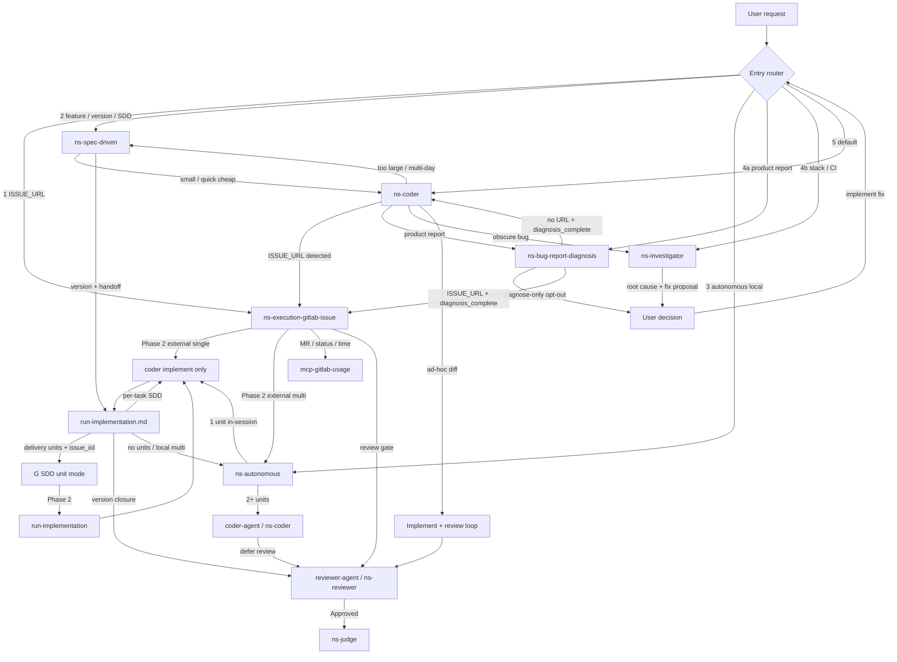

# Code skill routing

Runtime routing: **entry priority** + cross-skill handoffs. Entry skills own triggers in `references/entry-triggers.md`. Each `SKILL.md` owns **handoffs out**.

**Derived:** `docs/coder-skill-routing.md` — do not hand-edit. Maintainer: `.cursor/skills/code-routing-diagram/`. Optional regen:

```bash
node packages/harness/scripts/generate-coder-skill-routing-doc.mjs
```

## Roles

| Role | Skill | Notes |
| ---- | ----- | ----- |
| Front door | Host + descriptions + this file | Fixed priority — not dedicated skill |
| Central execution | `ns-coder` / `C2` via spawn gate (`coder-agent` when heavy) | G, A, S converge — `subagent-dispatch.md` |
| GitLab lifecycle | `ns-execution-gitlab-issue` | External Phase 2 single-unit → `coder-agent`; multi-unit → `A`; SDD unit → `run-implementation.md` |
| Multi-unit engine | `ns-autonomous` | Standalone or Engine under G when multi-unit |
| Spec / version planning | `ns-spec-driven` | Quick cheap in-session; heavy → `coder-agent` when available |
| Product report | `ns-bug-report-diagnosis` | Screen story; chat only; no patch **here**; then `G` (URL) or `C` unless diagnose-only |
| Root-cause | `ns-investigator` | Stack/CI/log; diagnosis + Suggested Code; implement = separate user step |
| Review gate | `ns-reviewer` via `reviewer-agent` (**MUST** when available) | Code path — `../ns-reviewer/references/review-gate-workflow.md` |
| Delivery gate | `ns-judge` in-session after `Code Review: Approved` | Same parent; no `judge-agent` v1 — `../ns-judge/SKILL.md` |

## Install vs runtime

`ns-coder` `depends` installs peers at install time. Does **not** make coder the runtime router.

## Entry priority (host agent) {#entry-priority}

Scan **1 → 5**; **first matching signal wins**. Lower beats higher — e.g. `ISSUE_URL` + multi-day feature → **1** (`G`), not 2 (`S`).

| Priority | Signal | Entry skill | Trigger phrases |
| -------- | ------ | ----------- | ----------------- |
| 1 | External GitLab `ISSUE_URL` or explicit "implement this issue" | `ns-execution-gitlab-issue` | `../ns-execution-gitlab-issue/references/entry-triggers.md` |
| 1b | *(not entry scan)* SDD `unit` + `issue_iid` from `delivery-units.md` | `ns-execution-gitlab-issue` SDD unit mode | Dispatched by `ns-spec-driven` / `run-implementation.md` — **not** external URL |
| 2 | Feature / version / SDD / multi-day scope | `ns-spec-driven` | `../ns-spec-driven/references/entry-triggers.md` |
| 3 | "Run autonomously" with local plan, no issue | `ns-autonomous` | `../ns-autonomous/references/entry-triggers.md` |
| 4a | Product bug report — screen story (then auto-continue unless diagnose-only) | `ns-bug-report-diagnosis` | `../ns-bug-report-diagnosis/references/entry-triggers.md` |
| 4b | Root-cause only — stack/CI/log, **without** implement request | `ns-investigator` | `../ns-investigator/references/entry-triggers.md` |
| 5 | Default — quick fix, "implement X", small ad-hoc diff | `ns-coder` | `../ns-coder/references/entry-triggers.md` |

Scan is still **1 → 5**. 4a is checked before 4b. Either 4 row still beats 5.

### Multi-signal examples (first match wins) {#multi-signal-examples}

| User message (signals present) | Winner | Why |
| ------------------------------ | ------ | --- |
| `ISSUE_URL` + "big feature for v2" | Priority **1** → `G` | `ISSUE_URL` scanned before SDD scope |
| `ISSUE_URL` + pasted stack trace | Priority **1** → `G` | Issue execution owns worktree path |
| "Build notifications v2" + "CI is red" (no `ISSUE_URL`) | Priority **2** → `S` | SDD scope before investigator |
| "Run this plan autonomously" + stack trace in plan context | Priority **3** → `A` | Autonomous entry before diagnosis-only |
| "When I publish, the UI hangs" (no "fix") | Priority **4a** → `BRD` | Product report, no implement |
| Paste stack trace, no screen story, no implement words | Priority **4b** → `I` | Stack/CI diagnosis-only |
| "Fix this NullPointerException" | Priority **5** → `C` | Implement intent → coder, not diagnosis |

### Tie-breakers {#tie-breakers}

Only when priority table alone insufficient:

- Bug + large / multi-day (no `ISSUE_URL`) → **2** (`ns-spec-driven`).
- Product report (screen, expected vs actual), no implement → **4a** (`ns-bug-report-diagnosis`).
- Stack/CI/log, no screen story, no implement → **4b** (`ns-investigator`).
- Bug + quick fix, **cause obvious** → **5** (`ns-coder`).

### Priority 4 vs 5 {#priority-4-vs-5}

See entry-triggers for `ns-bug-report-diagnosis`, `ns-investigator`, and `ns-coder`. **Heuristic:** code change → **5**; screen story → **4a**; stack/CI → **4b**. One clarify when ambiguous; default **5**.

### Fallback

No match → **5** (`ns-coder`). Still unclear after one question: coder escalates per stop conditions.

Mid-run escalations (`C → G`, `C → S`, `C → BRD`, `C → I`) = same signals.

## Handoff edges {#handoff-edges}

Detail in each `SKILL.md` routing section.

| From | Condition | To |
| ---- | --------- | -- |
| `C` | `ISSUE_URL` detected | `G` |
| `C` | too large / multi-day SDD | `S` |
| `C` | product report, no implement, **no** `diagnosis_complete` | `BRD` |
| `C` | `diagnosis_complete: true` (BRD payload) | Implement — **do not** return to `BRD` |
| `G` | BRD handoff with URL + `diagnosis_complete` | Execution — **do not** return to 4a |
| `C` | obscure bug (stack/CI) | `I` |
| `C` | ad-hoc diff | `REV` then `JUDGE` if `Code Review: Approved` (`reviewer-agent` → `ns-reviewer`; parent reads `ns-judge`) |
| `G` | Phase 2 external, single unit | `coder-agent` / `ns-coder` in worktree (**skip** `A`) |
| `G` | Phase 2 external, multi-unit | `A` (engine mode) |
| `G` | Phase 2 SDD unit | `run-implementation.md` (unit tasks; **not** `A`) |
| `G` | MR / status / time | `mcp-gitlab-usage` |
| `G` | review gate | `REV` then `JUDGE` if Approved (`reviewer-agent` / `ns-reviewer` only for code) |
| `A` | 1 work unit | In-session `ns-coder` (worktree); defer `REV` to parent |
| `A` | ≥2 work units | `C2` (`coder-agent` → `ns-coder` — **MUST** when available); implement only |
| `C2` | implement done | Parent `REV` at closure — **no** per-unit review |
| `S` | small / quick | In-session `C` (cheap — **MUST NOT** spawn `coder-agent`) |
| `S` | version + handoff | `H` → `C` or `A` or `G` unit mode (**MUST** `coder-agent` for heavy coding workers when available) |
| `H` | delivery units + `issue_iid` | `G` SDD unit mode (`unit` + `issue_iid` — not external URL) |
| `H` | per-task coding (no unit issues) | `C` implement only — no per-task `REV` / `JUDGE` (SDD handoff) |
| `H` | all tasks done | `REV` version closure (`run-implementation` Step 5) then `JUDGE` if Approved |
| `REV` | `Code Review: Approved` | `JUDGE` (`ns-judge` in-session) |
| `I` | diagnosis complete | User (no auto-dispatch to `C`) |
| `BRD` | diagnose-only opt-out | User (stop) |
| `BRD` | `ISSUE_URL` after diagnosis | `G` |
| `BRD` | no URL after diagnosis | `C` |
| User | implement after investigator (or diagnose-only) | Re-enter entry router (usually `C`) |

## Engine anti-cycle (G ↔ A) {#engine-anti-cycle}

**External:** `G` invokes `A` Engine **only** when multi-unit (`planning-decision.md`). Single-unit external: `coder-agent` in existing worktree — no A. When A runs: units as `C2` (or in-session for 1 unit) in existing worktree + branch. `A` + `C2` must not re-open `G` — no standalone routing, no GitLab MCP mutations, no new worktree. `ISSUE_URL` in code/comments = context, not signal. `G` owns lifecycle until delivery. Rejection loops stay inside (`G → A → C2 → REV` or `G → Cimpl → REV`).

**SDD unit:** `G` invokes `run-implementation.md` / `Cimpl`. No `A`. Rejection (`G → Cimpl → REV`) stays inside. Status/spent: `delivery-units.md` **GitLab status/spent (SSoT)**.

See `../ns-autonomous/references/routing.md`.

## Investigator handoff {#investigator-handoff}

`I` ends: root cause + fix proposal. **No** auto-dispatch. User asks implement → re-enter router (usually **5** → `C`). No direct `I → C` — human gate.

## Bug-report diagnosis handoff {#bug-report-diagnosis-handoff}

`BRD` ends: eight-section chat report (tester + fixer pointer). Readonly **in BRD**. Then auto-dispatch: `ISSUE_URL` → `G`; else → `C`, with `diagnosis_complete: true`. Diagnose-only phrases ("do not fix", "só diagnostica") → stop at the user. `U2` is **opt-out only**. Low confidence still dispatches. `C`/`G` receiving that payload must not bounce to 4a. Full rule: `../ns-bug-report-diagnosis/references/continue-handoff.md`.

## Skill handoffs (diagram source)

Mermaid extracted into `docs/coder-skill-routing.md` by generator.


