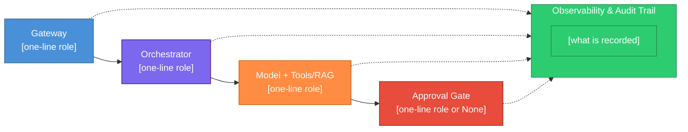

# Reference architecture — five canonical blocks

Map every case to the same AI-first reference diagram before subtask decomposition. Structure is fixed; content per box changes.

## The five blocks

| Block | Role | Typical implementation |
| ----- | ---- | ---------------------- |
| **Gateway** | Single entry: auth, rate limit, format validation, initial routing | API route, webhook receiver, queue consumer |
| **Orchestrator** | Deterministic brain: step sequence, when to call the model, output checks | LangGraph edges + deterministic nodes (not LLM nodes), CrewAI process, workflow engine |
| **Model + Tools/RAG** | Only non-deterministic block: reasoning, retrieval, tool calls | LLM node(s), RAG pipeline, MCP tools |
| **Approval Gate** | Human pause when proposed action crosses business risk threshold | `interrupt()`, review UI, async review queue |
| **Observability** | Audit trail **across** the four blocks — not a fifth sequential step | Postgres audit, LangSmith, OTel, structured logs |

Subtask rows from decomposition map **into** these blocks (usually Orchestrator or Model + Tools/RAG). Rules and routers are Orchestrator; LLM work is Model + Tools/RAG.

## LangGraph container vs doctrine blocks

Compiled `StateGraph` / `graph.ts` = **container**. Not a doctrine block.

| Graph part | Doctrine block |
| ---------- | -------------- |
| Compiled `StateGraph` / `graph.ts` | Container — not a block |
| Edges, `addConditionalEdges`, rule/router nodes | Orchestrator |
| `addNode` that invokes LLM / tools / RAG | Model + Tools/RAG |
| `interrupt` | Approval Gate |
| Audit / traces | Observability |

Classify subtasks first. Then assemble the graph.

Anti-pattern: list LLM nodes under Orchestrator. Treat compiled graph as Orchestrator. Forbidden.

## Interview — Step 2 (reference mapping)

After objective and end-to-end journey (Step 1), walk the five blocks **one question per turn**:

1. **Gateway** — how requests enter today (or would); auth and validation
2. **Orchestrator** — what decides the next step deterministically
3. **Model + Tools/RAG** — where non-deterministic reasoning and retrieval live
4. **Approval Gate** — where human approval is required, or `none` with reason
5. **Observability** — what must be logged and why (route, model id, prompt version, gate outcome)

Infer from code in reverse mode; mark `status: inferred` until confirmed.

Present the colored Mermaid diagram **once** after block 5 is locked — ask the user to confirm or correct labels only.

## Mermaid template (report file)

Use this structure in the report. Replace node labels with this case's wording; keep `classDef` colors.

When Approval Gate is not used, keep the node with label `None — [reason]` (e.g. all actions reversible).

## Component mapping table (report file)

| Component | Role in this case | Exists today? |
| --------- | ----------------- | ------------- |
| Gateway | [what it does] | yes / no / partial |
| Orchestrator | [what it does] | yes / no / partial |
| Model + Tools/RAG | [what it does] | yes / no / partial |
| Approval Gate | [what it does or none] | yes / no / partial / n/a |
| Observability | [what is recorded and why] | yes / no / partial |

## Trade-off budget — Step 5

After subtask classification, assign a trade-off budget **per canonical component** (five rows). One turn per component: ask which axis is **non-negotiable** and propose latency/cost/precision targets from context.

| Axis | Values | Meaning |
| ---- | ------ | ------- |
| **Latency** | low / medium / high (or target, e.g. `<3s p95`) | Acceptable response time for this block |
| **Cost** | low / medium / high (or target, e.g. `<$0.02/turn`) | Token/API spend budget for this block |
| **Precision** | low / medium / high | Required correctness / recall for this block |
| **Non-negotiable axis** | latency \| cost \| precision | Which axis must not be sacrificed; others may flex |

Guidance by block:

| Component | Typical non-negotiable |
| --------- | ---------------------- |
| Gateway | Latency (fast reject) or precision (strict validation) |
| Orchestrator | Latency (predictable routing) |
| Model + Tools/RAG | Precision (domain) or cost (volume) |
| Approval Gate | Precision (human review quality) |
| Observability | Precision (audit completeness) — never skip in regulated tenants |

Record the full table in the report. Do not collapse to a single global budget.

## Architecture change signal — Step 6

One question, one locked answer: pick **one** of the five blocks (or observability) and state a **concrete observable signal** that would force an architecture change within ~6 months — a metric crossing a threshold, a recurring error pattern, or cost no longer justified. Do not propose the fix; name the signal only.

Examples (adapt to domain):

- "HITL reject rate on Approval Gate >25% for two consecutive sprints → gate placement or model tier is wrong."
- "Model + Tools/RAG p95 latency >8s while Gateway stays <200ms → split retrieval from generation or add cache."
- "Observability shows >40% of turns reclassified from agent to rule candidate → promote stable rows to deterministic code."

Distinct from **Reclassification trigger** (per subtask row). Change signal is **one sentence, one element, architecture-level**.
