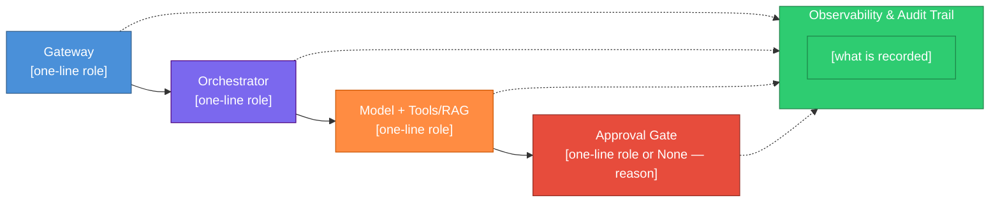
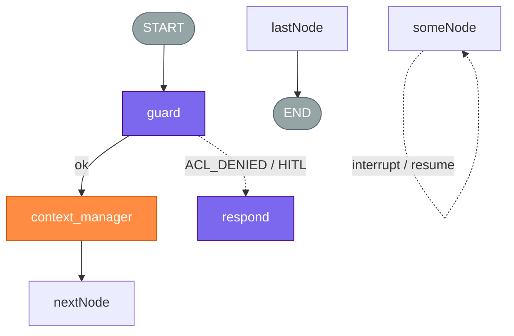

# Final report template

## Phase 1 — On-screen summary (chat only)

After the interview, post a concise recommendation in the conversation **before** writing any file:

- **Length:** ~200 words (hard cap — objective, no filler)
- **Content:** framework choice, one-sentence topology, main trade-off accepted, top risk, MVP scope hint
- **Do not** include mermaid, full agent list, or tooling tables in this summary

Then write the living ADR to **`docs/specs/agent-architecture.md`** (create `docs/specs/` if missing). Do not ask for a path. Do not write `docs/architecture/` or `docs/versions/`. Missing: create. Exists: update current-state sections; append Changelog + this Interview Record session. Never blind-replace.

## Phase 2 — Full report file (developer handoff)

The file must be **self-contained**: a developer who never saw the interview can read it and start implementation. Include every question asked, the recommended answer offered, the user's actual reply, and the locked decision derived from it. Also include the user's initial unprompted context.

Write the complete report to `docs/specs/agent-architecture.md` using the **section schema** below. The English headings in this template are the schema for the agent — **the written file** translates every heading, table header, and cell to the human's locked language (Language rule in `SKILL.md`), **except** doctrine ids (Gateway, Orchestrator, Model + Tools/RAG, Approval Gate, Observability): they stay English in the Component column and as the first line of each Mermaid box. Fill every **applicable** section — no placeholder text. If a framework-specific section does not apply, **omit the heading**. Do not write "does not apply" / "N/A" under an unused CrewAI or LangGraph heading. The one-line rejection in **Framework Recommendation** is the only mention of the unused framework.

**Component table:** id column = doctrine names (Gateway, …) in English. Role column = product prose only in locked language. Status column header + values in locked language (`Exists today?` / `yes` become the user's equivalents — never leave English headers beside non-English cells).

**Mermaid boxes:** first line = doctrine id (English). Second line = this case's role in the locked language. Do not translate or omit the first line.

```markdown
# Multi-Agent Architecture

> Generated by ns-multi-agent-architect skill
> **Handoff:** This document is the single source of truth for implementation. No prior conversation context is required.
> **Decision record:** the **Why this design** section is the durable rationale — README and `graph-spec.md` link here; they do not rewrite it.
> **Living:** one file for the product agent. Update in place. Append Changelog. Do not copy into `docs/versions/`.

## Changelog

| Version | Date | Summary |
| ------- | ---- | ------- |
| `{version_san}` or `adhoc-YYYY-MM-DD` | {ISO date} | {what architecture decision changed} |

## Problem Statement

[Restate the user's original request in 2–4 sentences — objective, domain, constraints mentioned upfront]

## Reference Architecture

Canonical AI-first diagram for this case. Structure is fixed; first line of each box is the doctrine id; second line describes this product.



| Component | Role in this case | Exists today? |
| --------- | ----------------- | ------------- |
| Gateway | [what it does] | yes / no / partial |
| Orchestrator | [deterministic control: sequence, edges, rule/router — not LLM node names] | yes / no / partial |
| Model + Tools/RAG | [what it does] | yes / no / partial |
| Approval Gate | [what it does or none + reason] | yes / no / partial / n/a |
| Observability | [what is recorded and why] | yes / no / partial |

## Subtask Decomposition

The three questions were applied **per subtask**, not to the product. Agent Design below derives from the rows classified as agents; rows classified as rules are orchestrator or plain code.

| Subtask | Type (extraction/interpretation \| business decision) | P1 | P2 | P3 | Component | Source | Status |
|---|---|---|---|---|---|---|---|
| [verb + object] | [type] | yes/no/n\|a | yes/no/n\|a | yes/no/n\|a | rule \| agent \| agent + gate (sync\|async) \| rule + conditional gate | interview \| code | confirmed \| inferred |

- P1 — finite rule covers >90% of real (observed) cases
- P2 — error costly **and** irreversible → gate before the action, sync when undo is impossible
- P3 — behavior changes with input context

Rows marked `rule + conditional gate` do not map to a single boolean triple — a known limit of the framework, not a gap in the analysis. Note the reason inline.

**Reclassification trigger:** [what in the logs would flip a row — stable pattern turning an agent into a rule, or growing exceptions turning a rule into an agent]

## Trade-off Budget

Per canonical component — latency, cost, and precision may flex; one axis is non-negotiable per row.

| Component | Latency | Cost | Precision | Non-negotiable axis |
| --------- | ------- | ---- | --------- | ------------------- |
| Gateway | [target or low/medium/high] | [target or low/medium/high] | [target or low/medium/high] | latency \| cost \| precision |
| Orchestrator | [target or low/medium/high] | [target or low/medium/high] | [target or low/medium/high] | latency \| cost \| precision |
| Model + Tools/RAG | [target or low/medium/high] | [target or low/medium/high] | [target or low/medium/high] | latency \| cost \| precision |
| Approval Gate | [target or low/medium/high] | [target or low/medium/high] | [target or low/medium/high] | latency \| cost \| precision |
| Observability | [target or low/medium/high] | [target or low/medium/high] | [target or low/medium/high] | latency \| cost \| precision |

## Architecture Change Signal

**Element:** [Gateway \| Orchestrator \| Model + Tools/RAG \| Approval Gate \| Observability]

**Signal (one sentence):** [concrete metric, threshold, or recurring pattern that would force an architecture change within ~6 months — name the signal only, not the fix]

## Why this design

Readable without the interview table. One line per row.

| Question | Locked answer |
| -------- | ------------- |
| Agent vs code | [one line summarizing the split — how many rows became rules, agents, gates] |
| One vs many | [one generalist vs specialists — vocab / tools / risk] |
| Concurrency / orchestration | [sequential vs parallel vs mixed — data dependence vs calendar order; rejected alternative in one clause] |
| Who uses the output | [role + what a wrong or slow answer costs them] |
| Topology / framework | [choice + rejected alternative in one clause] |
| HITL | [where recommendation stays until approve; sync vs async] |
| Success in production | [metric that is not exact LLM-text equality] |
| Out of MVP | [one line] |

## Interview Record

Full trace of the grilling session. One row per question.

| # | Question | Recommended answer | User answer | Locked decision |
|---|----------|-------------------|-------------|-----------------|
| 0 | [initial context captured without a question, if any] | — | [user's opening description] | [decision] |
| 1 | [question text] | [recommended answer] | [user reply] | [final locked decision] |

[Continue for every question in the session]

### Assumptions

List any reasonable assumptions made when the user was vague or silent. Mark each as `confirmed` or `assumed — validate with stakeholder`.

## Functional Requirements

Derived directly from locked interview decisions. Number each requirement.

| ID | Requirement | Source (interview #) |
|----|-------------|---------------------|
| FR-01 | [testable requirement] | Q[n] |

Cover at minimum: inputs, outputs, error behavior, human interaction, pipeline control, failure handling, scope/MVP boundaries.

## MVP Scope

| In scope (MVP) | Out of scope (post-approval / v2) |
|----------------|-----------------------------------|
| [item] | [item] |

## Framework Recommendation

- **Chosen framework:** [LangGraph or CrewAI]
- **Alternative considered:** [other framework + why rejected]
- **Technical rationale:** [Explain why based on locked decisions; cite control vs speed trade-offs]

## Proposed Architecture

- **Topology type:** [e.g. Sequential DAG, Hierarchical crew]
- **State management:** [How memory and data flow between steps]
- **Human interaction point:** [Where the human enters, or "None required"]

### State schema

```typescript
// or Python TypedDict — define the shared state object developers must implement
```

### Constraints (fill from interview — one line each)

| Constraint | Decision |
| ---------- | -------- |
| Eval / acceptance | Thresholds or structured contracts — not exact LLM text equality |
| HITL | Where output stays a recommendation until human approve (3 bands; always-scale categories even at high score; sync vs async) |
| End user | Who consumes the result; impact of error or delay |
| Success metric | Production signal that the architecture delivered value inside risk/cost/latency |
| Audit | Reconstruct route + tool + reason from persistence (yes/no + store) |
| Cost / latency | Per-turn cap and what happens on exceed |
| Degrade | Fallback when model/MCP/confidence fails — reduced function, not hard crash |

### Error contract

Define the structured error payload returned to the requester on fail-fast or interrupt.

```json
{
  "run_id": "",
  "status": "interrupted | validation_failed",
  "failed_at": "node_name",
  "message": "",
  "details": {}
}
```

### LangGraph flow diagram

Include this heading and mermaid **only** if LangGraph is the chosen framework. If CrewAI won: skip this entire subsection. Do not add a stub.

List **every** graph node. Paint each node with the five-block `classDef` (do not wrap nodes in doctrine `subgraph`s). Five-block Mermaid above stays role-level (one box each, doctrine title on line 1). Agent Design lists only `agent` rows.

**MUST — LangGraph node flowchart (readable):**

- One `flowchart TB` column: happy path top→bottom. Cycle as a single back-edge (`executor` → earlier node). No `subgraph` around doctrine blocks (cross-cluster edges are unreadable).
- Paint **nodes** with the same `classDef` as the five-block diagram: Orchestrator = `orchestrator` (purple), LLM = `model` (orange, including `context_manager`). START/END = `term` (gray).
- Approval Gate = **dashed** edges (`-.->`) labeled `interrupt` / error code; resume = self-loop or back to the same node. Do **not** add a cluster of interrupt boxes.
- Compact legend table under the mermaid (color → block → node ids).

**Node → block legend** (required): rule/router = Orchestrator; LLM = Model; `interrupt` = Approval Gate (dashed edges, not a box cluster).



| Color | Block | Node ids (this graph) |
| ----- | ----- | --------------------- |
| Purple | Orchestrator | [rule/router node ids] |
| Orange | Model + Tools/RAG | [LLM node ids] |
| Gray | — | START, END |
| Dashed edge | Approval Gate | `interrupt` / error codes |

### CrewAI team structure

Include this heading and table **only** if CrewAI is the chosen framework. If LangGraph won: skip this entire subsection. Do not add a stub (wrong: a heading plus "Does not apply. Framework = LangGraph.").

| Crew / Team | Agents | Process | Tasks flow |
|-------------|--------|---------|------------|
| [Team name] | [Agent roles] | [sequential / hierarchical / consensual] | [handoff description] |

## Agent Design (Persona Blueprint)

One entry per subtask row classified as agent. Rules and gates are not agents — they belong to the orchestrator.

1. **[Agent / node name]** `[MVP | production]`
   - **Subtask row:** [row name from Subtask Decomposition]
   - **Role / responsibility:** [What it does]
   - **Why this agent (not code / not a sibling):** [one sentence tracing back to P1/P2/P3]
   - **Sizing:** memory [short only | long-term + why] · planning [direct | chain-of-thought | reflection + why the extra call pays] · tools [count + why each] · action [reversible | behind gate]
   - **Inputs:** [What it reads from state]
   - **Outputs:** [What it writes to state]
   - **Agent tools:** [LLM-callable tools]
   - **Recommended model:** [Model + brief why]
   - **Acceptance criteria:** [How to know this node is done correctly]

[Repeat for each agent/node]

## Recommended Tooling Stack

### Agent tools (per-agent callable)

| Tool | Used by | Purpose |
|------|---------|---------|
| [name] | [agent/node] | [why] |

### Infrastructure and supporting tools

| Category | Recommendation | Why |
|----------|----------------|-----|
| Orchestration | [e.g. LangGraph SDK] | [fit] |
| State / persistence | [e.g. SQLite → Postgres] | [why] |
| Vector / RAG | [tool or N/A] | [why] |
| Document parsing | [tools] | [why] |
| Observability | [tools] | [why] |
| Output generation | [tools] | [why] |

Add domain-specific rows (OCR, ERP connectors, etc.) as needed.

## Implementation Plan

Phased checklist a developer can execute.

### Phase 1 — MVP foundation

- [ ] [concrete task]
- [ ] [concrete task]

### Phase 2 — Production hardening

- [ ] [concrete task]

## Next Steps and Risks

- **Identified risk:** [One concrete bottleneck or blind spot from the use case]
- **Implementation tip:** [One practical, framework-specific tip]
```
