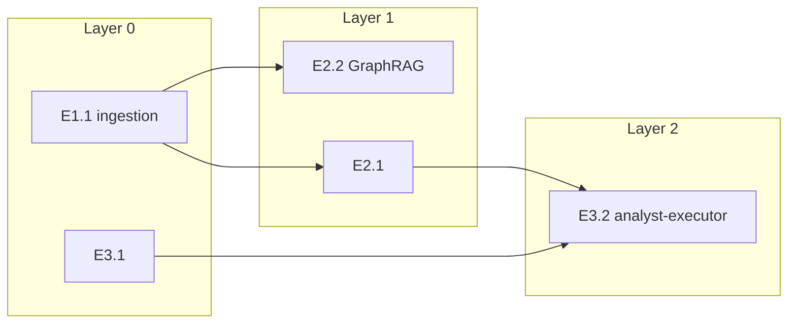

# Phase 3 — Prioritization + Sequencing (RICE/WSJF + DAG)

Senior PM. Value scores = script only. Execution order = DAG. You estimate dimensions + business justification; never hand arithmetic.

## Input decision table

| Input | RICE/WSJF | DAG | Execution order |
|---|---|---|---|
| Activity list (structured backlog, GitLab issues via MCP, task list with effort) | Full `rice_wsjf.py` — tables, ranking, justifications | Build from declared `depends_on` | No deps: RICE rank = order. With deps: DAG layers; RICE sorts **within** layer. Flag reorder: `[DAG-REORDERED: item X dropped from rank N to layer L because it depends on Y]` |
| Version narrative, no activity list | **Forbidden** — Reach/Confidence without anchor = invented numbers | Derive candidate deliverables from narrative; DAG by technical/data/contract prerequisites | Intra-layer: human-declared priority or technical risk — never fabricated score. Human asks RICE: one line what's missing (effort per item + OKR + reach); offer Phase 2 backlog first |

## Prerequisites

- Activity-list path: OKR from Phase 1 + structured backlog from Phase 2 (or user paste).
- Narrative-only path: version narrative + Phase 1 context; no fabricated effort/reach.

## Activity-list path — Step 1 backlog

User paste: use it. GitLab: MCP issue-list; weight/effort labels → Effort when present.

Missing backlog: fill-in — never guess count/scope:

```
[FILL IN — backlog items]
ID | Title | Effort (days or points) | Notes (dependencies, blockers)

Example:
US-01 | Speed Alerts               | 8 days  | No hardware blocker
US-02 | Predictive Maintenance     | 6 days  | Blocked — accelerometer hardware, 60-day lead time
US-03 | Maintenance Report Export  | 3 days  | Depends on US-01 data pipeline
```

Collect per item: `id`, `title`, `depends_on[]`, per-edge **technical reason** (e.g. `E1.1 → E2.2: GraphRAG needs ingestion index`).

## Activity-list path — Step 2 estimate + RICE/WSJF

Per item estimate (never hand-compute formula):
- **Reach:** users/transactions/month (business context if not explicit).
- **Impact:** 3=massive / 2=high / 1=medium / 0.5=low / 0.25=minimal.
- **Confidence:** 1.0=solid / 0.8=reasonable / 0.5=gut / <0.5=speculation.
- **Effort (person-months):** integrations, hardware deps, other teams.
- **Business Value / Time Criticality / Risk Reduction:** 1–10 each, anchored Phase 1 OKR.
- **Job Size:** 1–10 relative.

JSON array per item, run:

```bash
python3 scripts/rice_wsjf.py backlog.json
```

`RICE = (Reach × Impact × Confidence) / Effort`, `CoD = BV + TC + RR`, `WSJF = CoD / Job Size`. Never hand arithmetic.

## Shared — Step 3 DAG order

Merge RICE output (or narrative nodes) with `depends_on`. Run:

```bash
python3 scripts/dag_order.py backlog.json
# or pipe rice_wsjf output:
python3 scripts/rice_wsjf.py backlog.json | python3 scripts/dag_order.py -
```

Script rules:
- Layer 0 = no internal prerequisite; layer N depends on N−1 (Kahn topological sort).
- Empty deps on all items = single layer; **do not invent edges**.
- **Cycle in `cycles`:** STOP gate — do not order; return cycle; ask which dep is real vs mockable.

## Narrative-only path

1. Derive candidate deliverables from version narrative (domains, epics, technical milestones).
2. Build `depends_on` from technical/data/contract prerequisites — document per-edge reason.
3. Run `dag_order.py` only — no `rice_wsjf.py`.
4. Intra-layer order: human priority if stated; else technical risk (data contract before UI, ingestion before GraphRAG).
5. Human requests RICE: refuse with one line — missing effort per item + OKR + reach; offer Phase 2 structuring.

## Mandatory output (all paths)

1. **Mermaid diagram** — paste script `mermaid` or equivalent `flowchart LR` with layer subgraphs.
2. **Layer table** — layer index, items, intra-layer order.
3. **Executable order** — `topological_order` from script.
4. **Edges with reasons** — each `depends_on` + technical reason.
5. **DAG reorder flags** — from script `reordered[].flag` when activity-list path used RICE.
6. **Critical path** — from script `critical_path` (longest effort-sum chain).
7. Activity-list path also: RICE table, WSJF table, combined ranking, per-item Impact/Confidence justifications, Flags ⚠️ (Confidence < 70%, unresolved tech dep, Effort underestimated).

Sample Mermaid:



## Behavioral constraints

- Never invent market benchmarks — "no reference available", Confidence 0.5.
- Never omit input items — thin info = Flag, not silent drop.
- RICE never overrides real dependency — DAG sets layer; RICE sorts inside layer.
- Narrative-only: RICE/WSJF forbidden without activity list + effort + OKR anchor.
