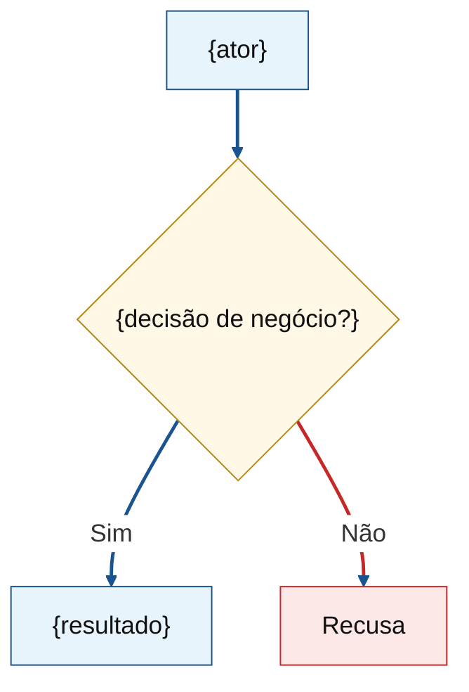
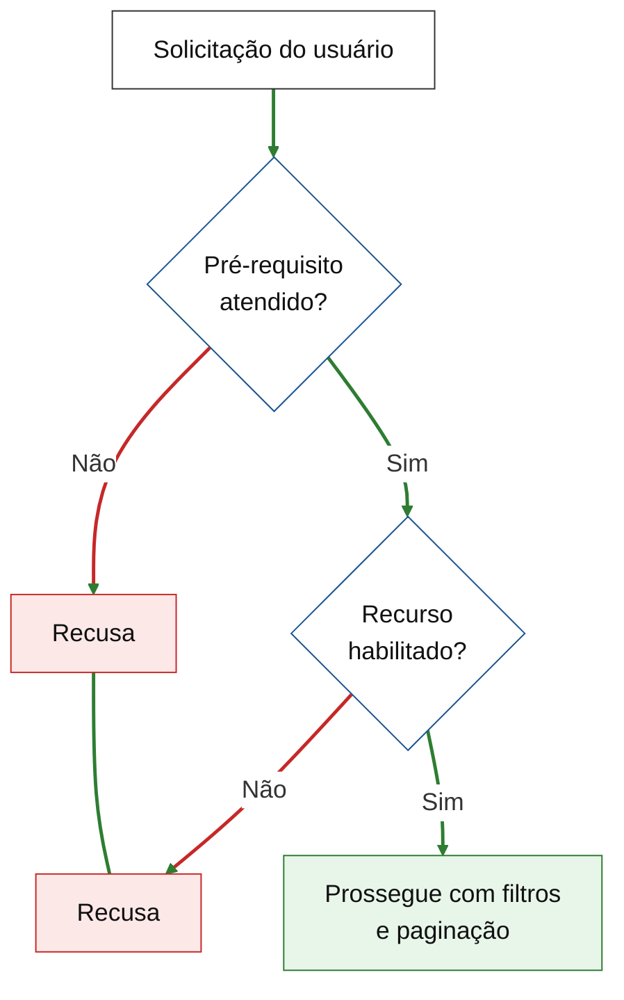

# Orçamento comercial — {product_display_name}

**Sequência:** `{seq}`  
**Gerado em:** `{generated_at}`  
**Versão / referência:** `{version_san}`  
**Idioma:** PT-BR

---

## Objetivo principal da versão

<!-- Mandatory three blocks: references/objective-structure.md -->

### O que buscamos

{Paragraph 1: outcome pursued — problem removed or capability unlocked; product/commercial language only.}

{Paragraph 2 (when context exists): who is affected, scale from brief, current workaround and why it does not scale.}

### O que é ({short concept name for this version})

{Paragraph: plain definition of the mechanism or capability — what it does in use.}

<!-- Optional when multi-layer: Camada | Papel table — stakeholder labels, not schemas/endpoints. -->

<!-- Optional: concrete example grounded in persona from brief. -->

### O que entregamos

{Paragraph: end-to-end scope in this version — what ships, how pieces connect in product terms.}

**Resultado esperado:** {One sentence — organizational outcome: scale, support load, self-service, etc.}

---

## Fluxos principais (validação de entendimento)

### Fluxo 1 — {TÍTULO}

<!-- Mandatory: flowchart TD, white init, classDef + linkStyle. See references/product-voice.md → Fluxos Mermaid. -->



### Fluxo N — Rejeições antes da entrega de dados

<!-- Optional dedicated validation chain. Palette B: green Sim arrows, red Não → Recusa, R1 ~~~ R2 stack. -->



<!-- Repeat ### Fluxo … (≤3 total). Cross-reference validation diagram from journey flows when useful. -->

---

## Agrupamento de objetivos (Features)

<!-- ≤10 Features. Client-first product language. No Precedência. No RF label. No task list. -->
<!-- Internal doc: may include `engenharia` and `qualidade` (0 FP) Features for delivery traceability. -->
<!-- Client export: use assets/commercial-budget-costumer.template.md — `negócio` only. See references/engineering-split.md. -->

### Feature 001 — {TÍTULO}

**Descrição detalhada:**  
{Rich continuous prose OK — who benefits, states, rules, boundaries. Same detail depth as client. See references/feature-description-structure.md.}

#### Critérios de aceite

- [ ] {product-verifiable — "o administrador consegue…", "o parceiro recebe…"}
- [ ] {product-verifiable}

### Feature 002 — {TÍTULO}

**Descrição detalhada:**  
{…}

#### Critérios de aceite

- [ ] {…}

<!-- Repeat Feature 003…N (≤10). -->

---

## Notas técnicas ({source label})

<!-- Internal only — omit entire section when no technical source. See references/technical-notes.md. -->

Detalhes acordados {source — e.g. na reunião de {date}, transcrição, POC} que orientam implementação — especialmente **Feature {NNN}** ({short title}) {when applicable}.

### {Subsection — e.g. Hoje vs. alvo}

| Aspecto  | Hoje ({as-is})  | Alvo ({version or target})           |
| -------- | --------------- | ------------------------------------ |
| {aspect} | {current state} | {target state} `[confirmado {name}]` |

<!-- Optional pseudocode block — label illustrative; name implementation owner when known. -->

```{lang}
// Pseudocode — implementação exata a cargo de {owner} por {unit, e.g. app}
{snippet}
```

> {Per-unit variance, POC prerequisite, or mapping caveat.}

### {Subsection — logical structure, boundaries, session behavior, prerequisites, scope, documentation}

<!-- Repeat ### subsections as needed. Tables, bullets, transcript timestamps. -->

---

## Requisitos Não Funcionais (RNFs)

<!-- Omit if none. No invented SLAs. -->

- {RNF traced to scope or clarification}

---

## Estimativas

### Pontos de Função (FP)

A unidade de mensuração é a Análise de Pontos de Função (APF).
A contagem dos pontos de função foi realizada de acordo com o Manual de Práticas de Contagem (Counting Practices Manual - CPM) publicado pelo International Function Point Users Group (IFPUG), na sua versão mais atual ({edition, e.g. CPM 4.3.1}).
Situações não contempladas pelo CPM foram contadas com o Roteiro de Métricas de Software do SISP, na versão mais atual ({edition, e.g. SISP 3.0}). {Or: nenhuma situação fora do CPM.}

| Campo                  | Valor                                               |
| ---------------------- | --------------------------------------------------- |
| Tipo de contagem       | {Desenvolvimento \| Melhoria \| Aplicação}          |
| Fronteira da aplicação | {inside this product vs users / other applications} |

| Feature     | FP      | Justificativa                |
| ----------- | ------- | ---------------------------- |
| Feature 001 | {n}     | {product-language rationale} |
| Feature 002 | {n}     | {…}                          |
| **Total**   | **{n}** |                              |

#### Origem do cálculo (APF)

| Elemento      | Tipo               | Contribuição  | RET/FTR | DET | Complexidade       | UFP     | Base        | Fonte               |
| ------------- | ------------------ | ------------- | ------- | --- | ------------------ | ------- | ----------- | ------------------- |
| {…}           | {ILF/EIF/EI/EO/EQ} | {ADD/CHG/DEL} |         |     | {Low/Average/High} |         | {CPM\|SISP} | Feature 00N / reuse |
| **Total UFP** |                    |               |         |     |                    | **{n}** |             |                     |

<!-- COSMIC (CFP): omit entire subsection unless the human explicitly asked for COSMIC/CFP. See references/cosmic-sizing.md. -->

### Horas previstas (cálculo)

| Item                 | Valor                               |
| -------------------- | ----------------------------------- |
| Total FP             | {n}                                 |
| Produtividade        | {h/PF from human or `[ASSUMPTION]`} |
| Horas base           | {n} FP × {h/PF} = **{n} h**         |
| Margem de segurança  | {s}%                                |
| **Total com margem** | **{n} h**                           |

---

## Macroatividades do projeto

<!-- Hours = with safety margin. Fixed 7 rows. See references/macro-activities.md. -->

| Macroatividade                           | PF             | Esforço (h) | Custo (R$)   |
| ---------------------------------------- | -------------- | ----------- | ------------ |
| Engenharia de requisitos                 |                |             | {n or —}     |
| Design / Arquitetura                     |                |             |              |
| Implementação                            |                |             |              |
| Testes de implementação (unitário e e2e) |                |             |              |
| Testes de homologação                    |                |             |              |
| Homologação                              |                |             |              |
| Implantação                              |                |             |              |
| **Σ**                                    | **{Total FP}** | **{n}**     | **{n or —}** |

**Notas:**

- Base: {h} h · Margem de segurança: {s}% · Total com margem: {h} h
- Mix %: {default or adjusted — cite in premissas}
- Custo: só com R$/h e/ou R$/PF informados; senão `—` e `_pending rates_`

---

## Riscos e margem de segurança

| Risco  | Impacto na estimativa | Mitigação / premissa   | Responsável               |
| ------ | --------------------- | ---------------------- | ------------------------- |
| {risk} | {impact}              | {mitigation or lacuna} | Cliente / Empresa / Ambos |

- **Margem de erro estimada:** {p}%
- **Margem de segurança aplicada:** {s}%
- **Racional:** {risks → percentages}

---

## Premissas e ressalvas

- {assumptions — team knowledge, delta-on-known-product, macro mix, margins, out-of-scope, lacunas}
- Este artefato **não** contém lista de tarefas (`tasks/`), issues GitLab nem handoff SDD.
- Custo em R$ só com taxas fornecidas; margem de segurança = contingência de estimativa, não markup comercial.

---

## Sugestões fora de escopo (não implementar)

<!-- Optional. Omit if empty. -->

- {idea} — fora do orçamento atual

---

## Próximos passos (informativo)

Após aprovação do escopo e estimativas: detalhamento SDD e/ou forecast PM — **fora desta skill**.
