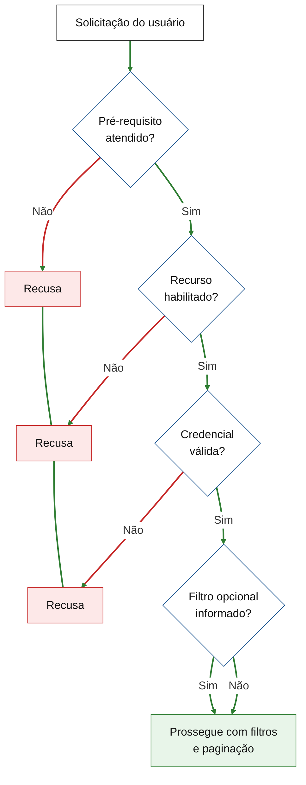
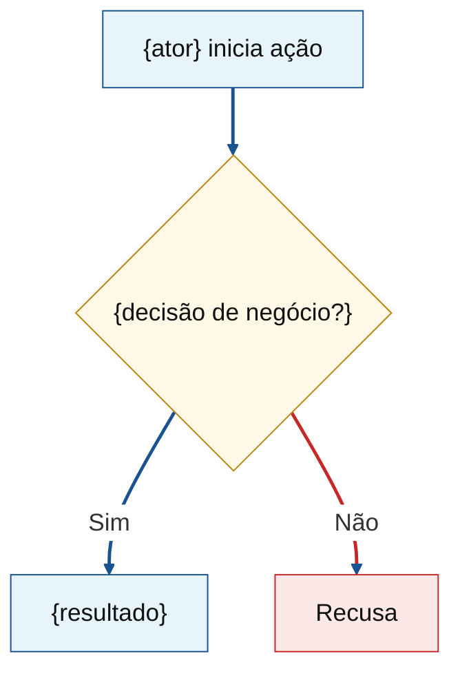

# Dual-audience voice (commercial budget)

Deliverable serves **client first**, also **delivery team**. Client confirms scope understanding; team must not lose sizing-critical detail.

## Audience test

| Section | Client reads | Team needs |
|---------|--------------|------------|
| Objetivo, **Valor agregado** (client export), Features, fluxos, RNFs, riscos (narrative) | Plain product/commercial language | Same text must cover every committed capability; Valor agregado = locked decision-maker speech (`sales-value-speech.md`) |
| Critérios de aceite | Verifiable by stakeholder | Each criterion maps to scoped behavior — no hidden gap |
| Estimativas (FP, horas; COSMIC only if asked) | Totals + per-Feature FP justification; client table also Esforço (h) / Custo (R$) or `—` | FP origins traceable; hours = formula only; CFP table only when requested |
| Macroatividades | Lifecycle effort split | Unchanged |

**Rule:** _Would client sign this knowing what they buy?_ AND _Would engineering find missing boundary?_ Both must pass.

## Valor agregado (client export only)

Section **Valor agregado desta versão** sits **immediately after Objetivo** in `commercial-budget-costumer.md`. It is a **locked sales speech** for an executive talking to the **decision-maker** (CEO, CFO, operations director). It is **not** a second Objetivo, **not** a Feature list, **not** a pitch to the operator who will click the product.

**Writing brief (mandatory):** follow `references/sales-value-speech.md` exactly — four headings, addressee, tone, gain shape, objection kinds. Do not invent extra subsections or a personal commercial angle.

Product language (`Forbidden in narrative sections` still applies). Operator / persona from the brief grounds **examples**, not the addressee.

Do not add a “Leia também” block — this section already lives inside `commercial-budget-costumer.md`.

When scope mixes business capabilities with operational/architectural consequences, apply `references/engineering-split.md`: internal doc keeps full traceability; client export (`commercial-budget-costumer.md`) shows `negócio` Features only, with `engenharia` outcomes merged into parent acceptance and FP rolled into **Engenharia de consistência do produto**.

## Item classification (before Features)

| Class | Client Feature? | Where acceptance lives |
|-------|-----------------|------------------------|
| `negócio` | Yes | Own Feature |
| `engenharia` | No (client doc) | Merged into parent `negócio` criteria |
| `qualidade` | Never | RNF on quality; 0 FP |

See `engineering-split.md` for triggers, templates, anti-patterns.

## Client-facing (default)

- Business capabilities, journeys, roles, outcomes, constraints
- Stakeholder menu/screen labels from brief
- Delivery uncertainty in product terms (homologação, contrato parceiro, escopo aberto)

## Technical detail — where it lives

| Need | Put it here | Not here |
|------|-------------|----------|
| Scope completeness | Features + critérios de aceite + fluxos Mermaid | Class names, schemas, endpoints |
| Sizing traceability | Internal: APF origem (CPM/SISP). Client: per-Feature FP + justificativa only | Feature narrative; client `commercial-budget-costumer.md` |
| COSMIC counts | Omit unless asked; then Estimativas: CFP table only | Unsolicited CFP; per-Feature E/R/W/X prose |
| Productivity math | Estimativas: Horas (cálculo) | Narrative justification in horas row |

## Forbidden in narrative sections

- Class, service, module, file names
- DB tables/columns, ORM, migrations
- API field lists, HTTP codes, OpenAPI as story
- Frameworks/infra unless human made them **commercial** constraint — one plain line max
- Code snippets, `/api/...` paths as Feature story
- Internal paths (`docs/context/...`) — say "contexto de produto consultado" if needed

## Rewrite patterns

| Leak | Rewrite |
|------|---------|
| Filter `tipo_pessoa = restrito` | Só cadastros da categoria elegível ao parceiro |
| Persist `api_key` hash | Admin atualiza chave de acesso da integração |
| EO/EQ IFPUG ILF | Internal origem table only; Feature = capability; omit from client commercial doc |
| GET paginated | Consulta paginada dos cadastros elegíveis |

## Acceptance criteria

Product checks: who does what, what appears, what must not happen. "O administrador consegue…" / "O parceiro recebe…" — not "controller retorna 401".

## Fluxos Mermaid

1–3 diagrams max. Labels = roles + business actions (Portuguese in deliverable; English only when human asks English doc). Purpose: client validates understanding; team spots missing steps. No technical node names.

Subtitle each diagram: `### Fluxo N — {readable title}`.

### Layout (mandatory)

- Prefer **`flowchart TD`** (top-down). Use `LR` only for very short linear flows (≤3 nodes).
- **Short labels** — max ~5 words per line; break long text with `<br/>` inside quoted nodes: `A["Short label<br/>continuation"]`.
- **Quoted node text** — always `["…"]` or `{"…"}` so special characters render safely.
- One diagram = one journey or one decision chain; split validation gates into dedicated diagram when main flow would exceed ~12 nodes.
- Cross-reference between diagrams when useful (e.g. `Validações de acesso<br/>(fluxo 3)`).

### Readability — nodes (mandatory)

Default Mermaid theme alone often unreadable in Markdown preview / PDF. Every diagram **must** include init block and `classDef` styling.

**Init block (copy verbatim):**

```
%%{init: {'themeVariables': {'fontSize': '18px', 'fontFamily': 'arial', 'background': '#ffffff', 'mainBkg': '#ffffff', 'secondBkg': '#ffffff', 'clusterBkg': '#ffffff', 'lineColor': '#1a5490', 'primaryBorderColor': '#1a5490', 'edgeLabelBackground': '#ffffff', 'primaryTextColor': '#111'}}}%%
```

For **validation / rejection** diagrams, set `'lineColor': '#2e7d32'` in init (green default arrows).

**Palette A — journey / process flows:**

```
classDef passo fill:#e8f4fc,stroke:#1a5490,color:#111
classDef decisao fill:#fff8e6,stroke:#b8860b,color:#111
```

| classDef | Use for |
|----------|---------|
| `passo` | Actions, outcomes, start/end nodes |
| `decisao` | Diamond decision nodes `{…?}` |

**Palette B — validation / rejection chain (dedicated “Fluxo N — Rejeições…” diagram):**

```
classDef inicio fill:#ffffff,stroke:#333,color:#111
classDef decisao fill:#ffffff,stroke:#1a5490,color:#111
classDef recusa fill:#fde8e8,stroke:#c62828,color:#111
classDef sucesso fill:#e8f5e9,stroke:#2e7d32,color:#111
```

| classDef | Use for |
|----------|---------|
| `inicio` | Entry node (user/partner request) |
| `decisao` | Diamond gates |
| `recusa` | Rejection terminals |
| `sucesso` | Success terminal after all gates pass |

Stack rejection nodes on right with invisible links: `R1 ~~~ R2` / `R2 ~~~ R3`.

### Readability — edges and arrows (mandatory)

After `class` lines, **always** add `linkStyle`.

**Palette A (journey):**

| Rule | Syntax |
|------|--------|
| All edges | `linkStyle default stroke:#1a5490,stroke-width:2.5px` |

**Palette B (validation chain):**

| Rule | Syntax |
|------|--------|
| Success / continuation (`\|Sim\|`, default forward) | `linkStyle default stroke:#2e7d32,stroke-width:2.5px` |
| Rejection (`\|Não\|` to Recusa) | `linkStyle {indices} stroke:#c62828,stroke-width:2.5px` |

**`linkStyle` indices** = order of edge declaration, **0-based** (count every `-->`).

Example (validation chain):

```
0  A --> B
1  B -->|Não| R1    # rejection (red)
2  B -->|Sim| C     # success (green via default)
3  C -->|Não| R2    # rejection
```

Then: `linkStyle default stroke:#2e7d32,stroke-width:2.5px` + `linkStyle 1,3 stroke:#c62828,stroke-width:2.5px`

Init `lineColor`, `primaryBorderColor`, `edgeLabelBackground`, and white `background` / `mainBkg` keep arrows, labels, canvas legible in preview/PDF.

### Canonical skeleton — validation / rejection chain

Agnostic pattern — adapt labels to product; keep structure. Optional filter: both `Sim` and `Não` may converge on success (no rejection for omitted optional filter).



### Canonical skeleton — journey flow



### Anti-patterns

- `flowchart LR` with long sentence labels crammed into one node.
- Default theme only — low contrast; missing white canvas background.
- Missing `linkStyle` — thin grey arrows.
- Rejection paths same colour as success on validation-chain diagrams.
- Mandatory rejection for **optional** filter parameter — converge on success instead.
- Technical visible labels (class names, table names, HTTP paths).
- More than 3 diagrams or >12 nodes without splitting.

## Risks and premissas

Product/delivery language. Name **Responsável** (Cliente / Empresa / Ambos) per risk in table.
