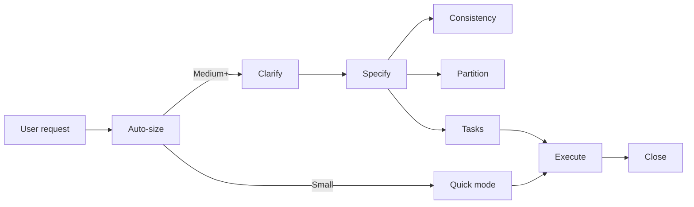

# NextStage Spec-Driven

**Delivery face** for spec-driven journey: clarify, specify, (consistency / partition), tasks, execute, close.

**Orchestrate** — **not** implement phase bodies inline. **Read** phase reference at delegation time. State on **disk** (`docs/versions/`, `docs/context/`, handoff files), not chat history.

Entry priority **2** (feature / version / SDD / multi-day / resume). Harness table: `../../ns-harness/references/code-skill-routing.md`. Trigger phrases: `references/entry-triggers.md`. Bare quick fix, no SDD context → redirect `ns-coder` (priority 5) unless user explicitly invoked this skill.

## Routing (read first)

| Handoff                        | Target                                                                                                                       |
| ------------------------------ | ---------------------------------------------------------------------------------------------------------------------------- |
| Small / quick inside SDD       | `coder-agent` → `ns-coder` (**MUST** bridge when available — `../../ns-harness/references/subagent-dispatch.md`)             |
| Version + handoff              | `references/execution-handoff.md` + `../ns-coder/references/run-implementation.md` + `coder-agent` (**MUST** when available) |
| Task file generation           | `task-writer-agent` → `references/task-generator.md` (**MUST** bridge when available)                                        |
| Bare quick fix, no SDD context | Redirect `ns-coder` (priority 5) — if spawning worker: **MUST** `coder-agent` when available                                 |

## Harness

See `../../ns-harness/references/session-boot.md`, `../../ns-harness/references/artifact-layout.md`, `references/gates.md`.

| Variable        | Resolve via                                          |
| --------------- | ---------------------------------------------------- |
| `{version_san}` | User scope or existing folder under `docs/versions/` |

## Out of band (not this skill)

**Brownfield onboarding** manual — never auto-run, never pipeline phase:

| Need                              | Skill                                                                      |
| --------------------------------- | -------------------------------------------------------------------------- |
| Full prepare after `harness init` | `/ns-harness prepare this repo` or `npx @nextstage-brasil/harness prepare` |
| Single worker only                | `/ns-harness` + architecture-rules / brownfield / reverse-spec / agents-md |

`architecture-rules.md` still stub or `docs/context/brownfield-map.md` missing and task needs them: **tell user run `/ns-harness prepare this repo`**, then stop — or continue SDD **only if they insist** after warning.

## Journey (delivery only)



| Phase       | When                         | Reference                                                                                                                                                                            |
| ----------- | ---------------------------- | ------------------------------------------------------------------------------------------------------------------------------------------------------------------------------------ |
| Clarify     | Ambiguity / gray areas       | `references/clarify-requirements.md` (in-session — no v1 bridge)                                                                                                                     |
| Specify     | Always for Medium+           | `references/requirements-generator.md` (in-session — no v1 bridge)                                                                                                                   |
| Consistency | Before tasks (Large+)        | `references/analyze-consistency.md` (in-session — no v1 bridge)                                                                                                                      |
| Partition   | Multi-slice versions         | `references/version-partitioner.md` (in-session — no v1 bridge)                                                                                                                      |
| Tasks       | Medium+ formal tasks         | `task-writer-agent` → `references/task-generator.md` (**MUST** when available) then `unit-test-task-generator.md` / `e2e-test-task-generator.md` + `references/execution-handoff.md` |
| Execute     | Always                       | See execute routing below                                                                                                                                                            |
| Close       | After delivery               | `reviewer-agent` → `ns-reviewer` (**MUST** when available) → `ns-living-spec`                                                                                                        |
| Quick       | ≤3 files, one-sentence scope | `coder-agent` → `ns-coder` (**MUST** when available)                                                                                                                                 |

Details: `references/auto-sizing.md`, `references/router.md`.

## Boot (mandatory, once per session)

1. Classify request → **Small / Medium / Large** (`references/auto-sizing.md`).
2. Check **resume** signals (`execution-handoff.md`, `version-roadmap.md`, partial version) → `references/session-continuity.md`.
3. **Agent runtime gate** — agent-api / intelligent SaaS (`references/agent-runtime-integration.md`): **MUST** load `ns-langgraph-agents` in session before any phase; **stop** if skill not installed.
4. Scan installed complements (soft) → `references/skill-integrations.md`.
5. Confirm **once** when needed: target version id, language for markdown artifacts — **natural chat** (`references/human-communication.md`). Never open with telegraphic status dump or phase jargon.

## Human communication

Chat short, natural language. **Read `references/human-communication.md` before any human gate or boot confirm.**

- Name next **deliverable** ("requirements document", "task files") — not internal phases ("Specify", "Clarify").
- Chat stand alone: highlights in plain language; document IDs only after meaning (**Gate 1 highlights** in that file).
- Never use `Reply:`, `Premise:`, or "go for Specify".
- Caveman / artifact-compress = **files only** — never chat.

## Orchestration mandate

- **Delegate** = spawn bridge when available (else read phase reference in-session). Not "skip reference" while bridge present. See `../../ns-harness/references/subagent-dispatch.md`.
- **Read** phase reference before that phase — never improvise from memory.
- **Do not** ask "continue to next phase?" between phases in same sized pipeline.
- **Do not** invoke `/ns-harness prepare` or brownfield prepare references.
- **Do not** load multiple version specs into context — see `references/context-budget.md`.
- After each phase, verify expected artifact paths exist before advancing.

## Auto-size summary

| Size       | Pipeline                                                                                                        |
| ---------- | --------------------------------------------------------------------------------------------------------------- |
| **Small**  | `coder-agent` → `ns-coder` (quick mode — `references/quick-mode.md`)                                            |
| **Medium** | Clarify (if needed) → Specify → Tasks (**MUST** `task-writer-agent` when available) + handoff → Execute → Close |
| **Large**  | Full chain including Consistency and/or Partition when scope warrants                                           |

**Safety valve:** scope exceeds ~3 files or explodes mid-session → stop, formalize via Medium+ pipeline (requirements + tasks).

## Execute routing

Worker dispatch: **MUST** use harness project agents when available — `../../ns-harness/references/subagent-dispatch.md`. Inline mapped skill while bridge present = forbidden.

| Context                                    | Worker                                                                                                                                                                                                                                                                                                                |
| ------------------------------------------ | --------------------------------------------------------------------------------------------------------------------------------------------------------------------------------------------------------------------------------------------------------------------------------------------------------------------- |
| Ad-hoc / quick / single task               | `coder-agent` → `ns-coder` (**MUST** bridge when available)                                                                                                                                                                                                                                                           |
| Version with `execution-handoff.md`        | `../ns-coder/references/run-implementation.md` — classic **batched** dispatch (same-layer consecutive `pending`, prefer 4–7, hard max 7; size 1 = single task) + `coder-agent` (**MUST** when available) / `ns-coder` or `ns-autonomous`; handoff rows stay per task; Progress **Next task** = first id of next batch |
| Partitioned version (`version-roadmap.md`) | `references/orchestrator.md` (slice workers via `coder-agent` — **MUST** when available; already batched per slice)                                                                                                                                                                                                   |
| GitLab issue URL + MCP available           | `ns-execution-gitlab-issue` (soft — prefer when GitLab present)                                                                                                                                                                                                                                                       |
| Autonomous multi-step local plan           | `ns-autonomous`                                                                                                                                                                                                                                                                                                       |

**Face = orchestrator** (`ns-spec-driven`); does not implement — drives `run-implementation.md` (classic) or `orchestrator.md` (slices).

**Tests while executing version tasks:** unit/integration only. **Forbidden** for agents to run E2E during task/batch loop; human runs E2E at version end (`../ns-coder/references/run-implementation.md`).

## Trigger → reference

| User says                                              | Read first                                                                        |
| ------------------------------------------------------ | --------------------------------------------------------------------------------- |
| "specify", "requirements for vX"                       | `references/router.md` → `requirements-generator.md`                              |
| "clarify", vague scope                                 | `references/router.md` → `clarify-requirements.md`                                |
| "implement", "build version", tasks exist              | `references/session-continuity.md` + Execute                                      |
| "quick fix", "just change X"                           | `references/quick-mode.md`                                                        |
| "resume", "continue version", partial `docs/versions/` | `references/session-continuity.md`                                                |
| "orchestrate slices", partitioned roadmap              | `references/orchestrator.md`                                                      |
| UI / design work                                       | `references/skill-integrations.md` → `ns-frontend-design`                         |
| README / docs                                          | `references/skill-integrations.md` → `ns-docs-writer`                             |
| security headers / modernize                           | `references/skill-integrations.md` → `ns-best-practices`                          |
| agent-api / intelligent SaaS / LangGraph scope         | `references/agent-runtime-integration.md` → `ns-langgraph-agents` (**mandatory**) |
| MR / PR review                                         | `ns-reviewer` directly (not this face)                                            |

## Agent runtime (mandatory when detected)

Non-negotiable for agent-api and intelligent SaaS products. See `references/agent-runtime-integration.md`. Greenfield with no `agent-api/`: Feature 001 = langgraph bootstrap, then version deltas.

## Complement integrations

`spec-driven` / `gitlab` / `agents` ship `ns-frontend-design`, `ns-docs-writer`, and `ns-best-practices` via `ns-coder` `depends`. Check `.agents/skills/` once per session; if present → **delegate** (`references/skill-integrations.md`). If absent (minimal install) → continue and recommend install once per session (agent runtime **not** optional — see above):

```bash
npx @nextstage-brasil/harness --skill ns-frontend-design --skill ns-docs-writer --skill ns-best-practices --no-scaffold -y
```

## Completion summary

When version or quick fix closes, report:

1. Artifacts written or updated (paths).
2. Handoff status if applicable.
3. Suggested next step (living spec done → next version clarify; quick fix → optional review).

## Forbidden

- Auto-run or chain `/ns-harness prepare`.
- List Prepare as SDD phase.
- Hard-require complement skills when missing from `.agents/skills/` (delegate when present; see **Complement integrations**).
- Plan or execute agent-api / intelligent SaaS work without loading `ns-langgraph-agents` when detection signals match.
- Generate requirements/tasks yourself without reading phase references / delegating task files via `task-writer-agent`.
- Skip `execution-handoff.md` when formal tasks exist for version.
- Address human with internal phase names ("Specify", "Clarify") or bot chrome (`Reply:`, `Premise:`).

## Invocation examples

```
/ns-spec-driven
```

```
Specify and implement user notifications for version 2.1
```

```
Quick fix: add nullable email field to the signup form
```

```
Resume implementation — handoff exists for docs/versions/1.0.0/
```

```
Continue partitioned version 3.8.0 — run pending slices from version-roadmap.md
```
