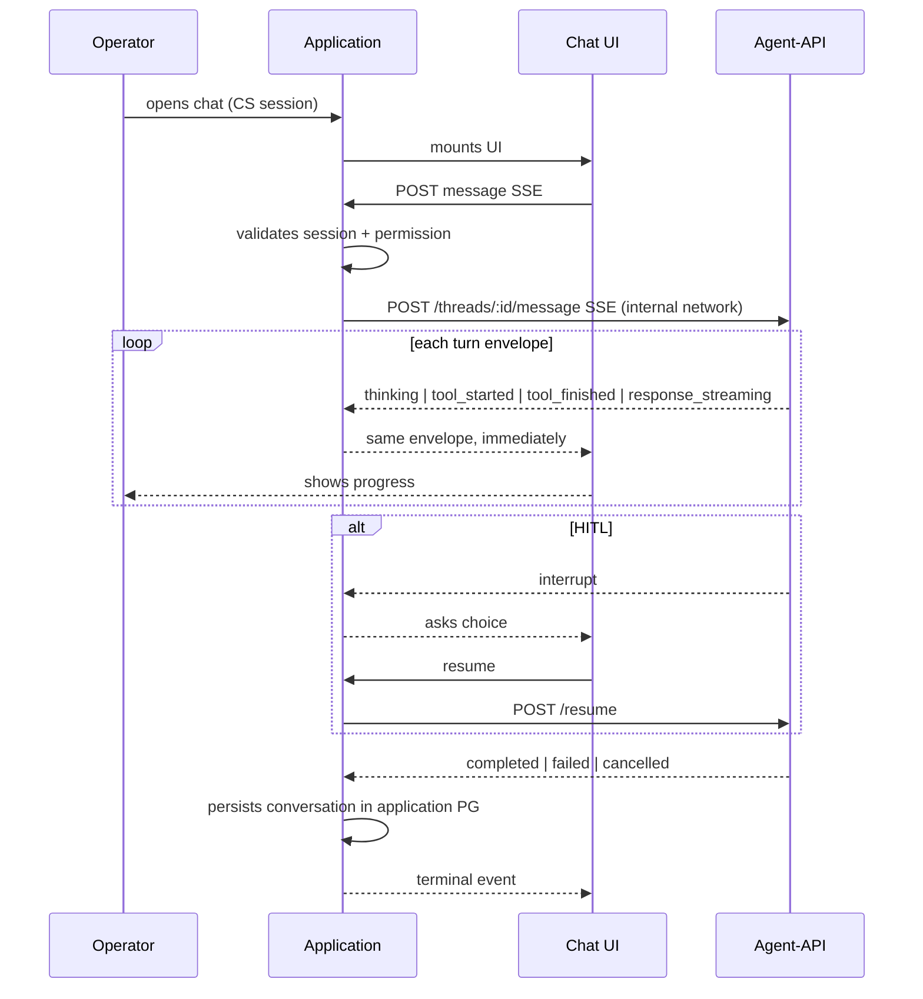

# Intelligent SaaS stack profile

Product includes backend, frontend, and agent-api (LangGraph or similar agent runtime).

## product_class

```markdown
## product_class
intelligent_saas

## Deliverables
- backend/
- frontend/
- agent-api/

## Architecture rule
Conversation hop (canonical) — Application owns chat; browser never calls agent-api directly
```

## Conversation hop (canonical)

SoT for `intelligent_saas` chat. Blocking invariant — `agent-runtime-integration.md`, `gates.md`.



### Ownership

| Layer | Owns |
| ----- | ---- |
| Application | Conversation SoT — history, CS session, permission, audit, application PG |
| Agent checkpointer | Turn execution state only — **not** conversation DB |
| Application | `thread_id` — create, map to session, rehydrate on resume |
| Agent-API `GET /dev-chat` | Local training UI when `DEV_CHAT_ENABLED` — **not** product chat surface |
| Application relay | SSE envelope forwarded as-is — relay only, no reinterpret |

### Forbidden

- Browser to agent-api (any route)
- Agent env or DNS in frontend bundle (`VITE_*`, `NEXT_PUBLIC_*` to runtime)
- `thread_id` created in browser
- Conversation persisted only in checkpointer
- `/dev-chat` exposed as product chat

## Mandatory setup features (before domain)

1. Monorepo infra — compose with app, frontend, agent-api, db, redis
2. Backend base + API auth
3. Backend agent proxy — HTTP/SSE relay to agent-api
4. Backend tool execution layer — internal endpoints consumed by agent
5. Agent runtime bootstrap — `ns-langgraph-agents` `bootstrap-agent-runtime.mjs` into `agent-api/` + `graph-spec.md`
6. Frontend shell — API base URL to backend only; no direct agent env in browser
7. Env wiring — service tokens, healthchecks

## Additional artifacts

- `docs/versions/{version_san}/graph-spec.md` when agent graph in scope
- Agent module features section or dedicated agent requirements merge

## References in harness

When `docs/context/intelligent-saas/` exists, read for graph + networking details.

`ns-spec-driven` parent: **MUST** load `ns-langgraph-agents` per `ns-spec-driven/references/agent-runtime-integration.md` before agent-api planning or execute.
